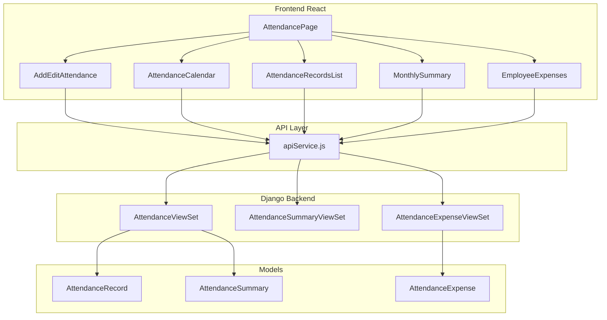

# Attendance Tracker Implementation Plan

## Overview
Port the complete C# attendance tracker to the Django/React/PyWebView desktop application.

## Architecture

## Todo List

### Phase 1: Django Backend Models ✅ COMPLETED

- [x] **Create [`AttendanceRecord`](sweetshopma-desktop/backend/api/models.py) model**
  - user (FK to User)
  - user_name (denormalized)
  - date
  - status (Present, Reset, AbsentWithPermission, AbsentWithoutPermission)
  - is_present (boolean)
  - regular_hours (Decimal)
  - overtime_hours (Decimal)
  - daily_pay (Decimal)
  - check_in_time (DateTime)
  - check_out_time (DateTime)
  - notes
  - absence_permission_type
  - created_at

- [x] **Create [`AttendanceSummary`](sweetshopma-desktop/backend/api/models.py) model**
  - user (FK to User)
  - user_name (denormalized)
  - month (DateTime)
  - days_present
  - days_absent
  - total_regular_hours
  - total_overtime_hours
  - total_payroll
  - expenses_total
  - rest_day_payout
  - absence_deductions

- [x] **Create [`AttendanceExpense`](sweetshopma-desktop/backend/api/models.py) model**
  - user (FK to User)
  - user_name (denormalized)
  - expense_date
  - amount (Decimal)
  - category
  - notes
  - created_at

- [x] **Run makemigrations and migrate**
  - Migration file: `api/migrations/0005_add_attendance_models.py`

### Phase 2: Django Serializers & Views ✅ COMPLETED

- [x] **Create [`AttendanceRecordSerializer`](sweetshopma-desktop/backend/api/serializers.py)**
  - Include all AttendanceRecord fields
  - Add computed properties (total_hours, check_in_display, check_out_display)

- [x] **Create [`AttendanceSummarySerializer`](sweetshopma-desktop/backend/api/serializers.py)**
  - Include all AttendanceSummary fields

- [x] **Create [`AttendanceExpenseSerializer`](sweetshopma-desktop/backend/api/serializers.py)**
  - Include all AttendanceExpense fields

- [x] **Create [`AttendanceRecordViewSet`](sweetshopma-desktop/backend/api/views.py)**
  - CRUD endpoints
  - Custom actions: summary, bulk_delete
  - Filtering by user, date range, status

- [x] **Create [`AttendanceSummaryViewSet`](sweetshopma-desktop/backend/api/views.py)**
  - List by month
  - Totals action for aggregated data

- [x] **Create [`AttendanceExpenseViewSet`](sweetshopma-desktop/backend/api/views.py)**
  - CRUD endpoints for employee expenses
  - Filtering by user, date range
  - by_user action for grouping

- [x] **Update [`urls.py`](sweetshopma-desktop/backend/api/urls.py)**
  - `/api/attendance/` - AttendanceRecordViewSet
  - `/api/attendance-summary/` - AttendanceSummaryViewSet
  - `/api/attendance-expenses/` - AttendanceExpenseViewSet

### Phase 3: Frontend API Service ✅ COMPLETED

- [x] **Add attendance endpoints to [`apiService.js`](sweetshopma-desktop/frontend/src/services/apiService.js)**
  - ATTENDANCE_RECORDS, ATTENDANCE_RECORD
  - CREATE_ATTENDANCE_RECORD, UPDATE_ATTENDANCE_RECORD, DELETE_ATTENDANCE_RECORD
  - ATTENDANCE_RECORDS_SUMMARY, ATTENDANCE_BULK_DELETE
  - ATTENDANCE_SUMMARIES
  - ATTENDANCE_EXPENSES, CREATE_ATTENDANCE_EXPENSE, DELETE_ATTENDANCE_EXPENSE

- [x] **Add attendance API methods**
  - getAttendanceRecords(filters)
  - getAttendanceRecord(id)
  - createAttendanceRecord(data)
  - updateAttendanceRecord(id, data)
  - deleteAttendanceRecord(id)
  - getAttendanceRecordsSummary(filters)
  - bulkDeleteAttendanceRecords(ids)
  - getAttendanceSummaries(month, userId)
  - getAttendanceExpenses(filters)
  - createAttendanceExpense(data)
  - deleteAttendanceExpense(id)

### Phase 4: Frontend Hooks ✅ COMPLETED

- [x] **Add attendance hooks to [`useApiData.js`](sweetshopma-desktop/frontend/src/hooks/useApiData.js)**
  - useAttendanceRecords(filters)
  - useAttendanceRecord(id)
  - useAttendanceRecordsSummary(filters)
  - useAttendanceSummaries(month, userId)
  - useAttendanceExpenses(filters)
  - useUsers (placeholder)

### Phase 5: Frontend Components ✅ COMPLETED

- [x] **Create [`ErrorMessage.jsx`](sweetshopma-desktop/frontend/src/components/common/ErrorMessage.jsx)**
  - Reusable error display component

- [x] **Create [`AttendancePage.jsx`](sweetshopma-desktop/frontend/src/pages/AttendancePage.jsx)**
  - Main attendance tracking page
  - Add/Edit attendance form
  - Statistics display
  - Calendar view
  - Monthly summary
  - Attendance records list with filtering
  - Employee expenses section

### Phase 6: Navigation & Routing ✅ COMPLETED

- [x] **Update [`App.jsx`](sweetshopma-desktop/frontend/src/App.jsx)**
  - Lazy load AttendancePage
  - Add route `/attendance`

- [x] **Update [`Sidebar.jsx`](sweetshopma-desktop/frontend/src/components/layout/Sidebar.jsx)**
  - Add Attendance menu item with Calendar icon

### Phase 7: Testing & Polish - IN PROGRESS

- [ ] Test attendance CRUD operations
- [ ] Test payroll calculations
- [ ] Test calendar view
- [ ] Test filtering and search
- [ ] Verify ES5 compatibility for PyWebView
- [ ] Test with PyWebView

## API Endpoints

| Method | Endpoint | Description |
|--------|----------|-------------|
| GET | /api/attendance/ | List attendance records |
| POST | /api/attendance/ | Create attendance record |
| GET | /api/attendance/{id}/ | Get attendance record |
| PUT | /api/attendance/{id}/ | Update attendance record |
| DELETE | /api/attendance/{id}/ | Delete attendance record |
| GET | /api/attendance/summary/ | Get summary stats |
| POST | /api/attendance/bulk_delete/ | Bulk delete records |
| GET | /api/attendance-summary/ | List monthly summaries |
| GET | /api/attendance-summary/totals/ | Get totals |
| GET | /api/attendance-expenses/ | List expenses |
| POST | /api/attendance-expenses/ | Create expense |
| DELETE | /api/attendance-expenses/{id}/ | Delete expense |
| GET | /api/attendance-expenses/by_user/ | Group by user |

## Status

**COMPLETED:**
- ✅ Django models, serializers, views, URLs
- ✅ Frontend API service methods
- ✅ Frontend hooks
- ✅ AttendancePage component
- ✅ Routing and sidebar navigation

**IN PROGRESS:**
- 🔄 Testing and polish

---
*Generated: 2026-02-04*
*Last Updated: 2026-02-04*
