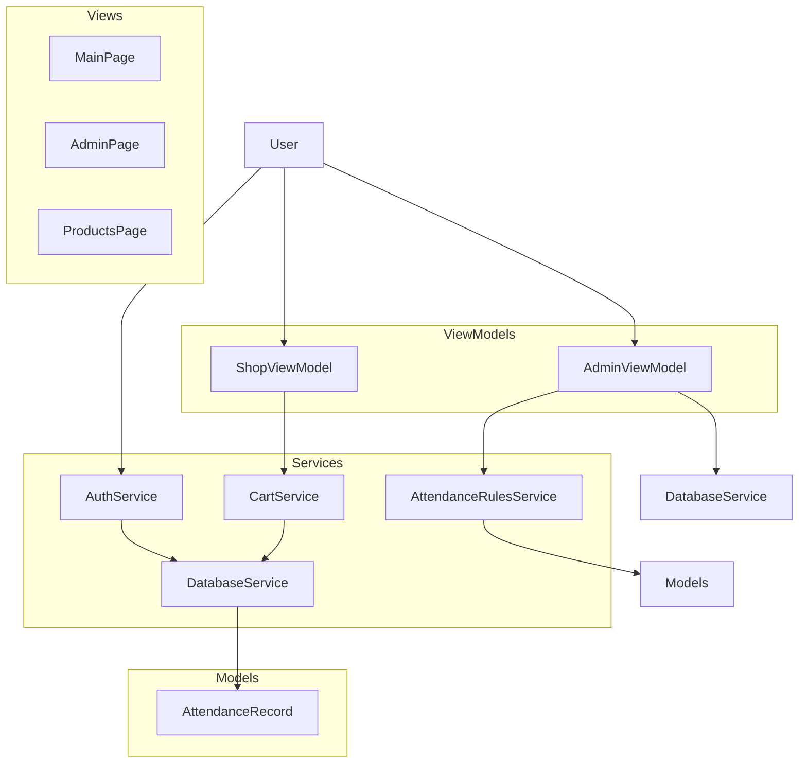

# SweetShopMa Application Code Review

## 1. Architectural Assessment

### Current Architecture
The application follows a standard MVVM (Model-View-ViewModel) architecture with:
- **Models**: Data entities (User, Product, Order, etc.)
- **Services**: Business logic and data access (DatabaseService, AuthService, etc.)
- **ViewModels**: UI-bound logic (AdminViewModel, ShopViewModel)
- **Views**: XAML UI components

### Strengths
- **Dependency Injection**: Proper DI setup in `MauiProgram.cs`
- **Thread Safety**: Database initialization with SemaphoreSlim
- **Localization**: RTL support with language switching
- **Modular Services**: Separation of concerns

### Areas for Improvement
- **State Management**: Complex state in viewmodels could be better structured
- **Offline Support**: No explicit offline-first strategy
- **Testing**: Limited test coverage visible

---

## 2. Security Analysis

### Critical Security Issues

#### Critical: Insecure Password Storage
**Issue**: Passwords are stored as plain text in the `User` model.
**Location**: `Models/User.cs` line 40-42

```csharp
public string Password { get; set; }
```

**Explanation**: The code shows the password is stored as plain text. While the `PasswordHelper` class provides hashing, the model itself doesn't enforce hashing. This creates a risk if the database is compromised.

**Severity**: Critical

#### Major: Insecure Default User
**Issue**: The application includes a hardcoded "Developer" user with admin privileges.
**Location**: `DatabaseService.SeedUsersAsync()` lines 548-566

```csharp
public async Task SeedUsersAsync()
{
    await InitializeAsync();
    var count = await GetUserCountAsync();
    if (count > 0) return; // Already seeded

    // Create default developer user
    var developer = new User
    {
        Username = "ama",
        Password = PasswordHelper.HashPassword("AsrAma12@#"),
        Role = "Developer",
        Name = "ahmad",
        IsEnabled = true,
        MonthlySalary = 0m,
        OvertimeMultiplier = 1.5m
    };
    await _database.InsertAsync(developer);
}
```

**Explanation**: A hardcoded developer user with known credentials is created if no users exist. While the password is hashed, the credentials themselves are exposed in source code, creating a significant security risk.

**Severity**: Major

#### Major: Insufficient Input Validation
**Issue**: Product barcode and search inputs are not properly validated.
**Location**: `ShopViewModel.FilterProducts()` lines 415-446

```csharp
// Search by barcode (contains)
foreach (var product in categoryFiltered)
{
    bool matches = false;
    
    // Check barcode (contains)
    if (!string.IsNullOrEmpty(product.Barcode) && 
        product.Barcode.ToLowerInvariant().Contains(searchLower))
    {
        matches = true;
    }
    // Also check name as fallback
    else if (product.Name.ToLowerInvariant().Contains(searchLower))
    {
        matches = true;
    }
    
    if (matches)
    {
        FilteredProducts.Add(product);
    }
}
```

**Explanation**: The search logic allows partial matches on barcodes and names, which could lead to ambiguous results or security vulnerabilities if malicious input is used.

**Severity**: Major

### Recommendations
1. Enforce password hashing in the model layer
2. Remove hardcoded admin users
3. Add input validation and sanitization
4. Implement proper role-based access control

---

## 3. Performance Analysis

### Performance Bottlenecks

#### Major: Inefficient Query Patterns
**Issue**: The `GetProductsAsync()` method loads all products and then performs an additional database query for sales data.
**Location**: `DatabaseService.GetProductsAsync()` lines 213-227

```csharp
var products = await _database.Table<Product>().ToListAsync();
var salesData = await _database.QueryAsync<ProductSalesData>(
    "SELECT ProductId, SUM(Quantity) as TotalSold FROM OrderItem GROUP BY ProductId");
```

**Explanation**: This approach results in two database queries and additional memory usage. A more efficient approach would be to join the data in a single query.

**Severity**: Major

#### Major: Memory Usage
**Issue**: The `Products` collection in `ShopViewModel` loads all products at once.
**Location**: `ShopViewModel.InitializeAsync()` lines 323-338

```csharp
var products = await _databaseService.GetProductsAsync();
// ... load stock for each product
Products.Clear();
foreach (var product in products)
    Products.Add(product);
```

**Explanation**: For large product catalogs, this can consume significant memory and cause performance issues on mobile devices.

**Severity**: Major

### Optimization Recommendations
1. Implement lazy loading or pagination for product lists
2. Use single SQL query with JOINs instead of multiple queries
3. Implement caching for frequently accessed data
4. Add pagination to report generation

---

## 4. SOLID Principles and Design Patterns

### Violations

#### Major: Violation of Single Responsibility Principle (SRP)
**Issue**: The `AdminViewModel` class has too many responsibilities.
**Location**: `AdminViewModel.cs` lines 21-35

```csharp
/// <summary>
/// ViewModel for the Admin Panel (AdminPage).
/// 
/// WHAT IS ADMINVIEWMODEL?
/// AdminViewModel manages all admin functionality including:
/// - User management (create, enable/disable users)
/// - Product management (add products)
/// - Reports and insights (sales, orders, top products)
/// - Attendance tracking (record and view attendance)
/// 
/// KEY RESPONSIBILITIES:
/// - Load and display users (excluding Developer users)
/// - Load and display products
/// - Calculate and display sales reports
/// - Manage attendance records
/// - Calculate monthly attendance summaries
/// </summary>
public class AdminViewModel : INotifyPropertyChanged
```

**Explanation**: The viewmodel handles user management, product management, reports, and attendance tracking - all unrelated concerns. This violates the Single Responsibility Principle.

**Severity**: Major

#### Minor: Violation of Open/Closed Principle (OCP)
**Issue**: The `ShopViewModel` has hardcoded logic for different product types.
**Location**: `ShopViewModel.cs` lines 169-178

```csharp
// When product is selected, set default quantity based on product type
if (value != null)
{
    QuickQuantityText = value.IsSoldByWeight 
        ? Utils.AppConstants.DefaultWeightQuantity.ToString(...) 
        : Utils.AppConstants.DefaultUnitQuantity.ToString(...);
}
```

**Explanation**: The logic is hardcoded and doesn't allow for easy extension of new product types.

**Severity**: Minor

### Design Pattern Issues

#### Major: Inconsistent Command Pattern Implementation
**Issue**: The `ShopViewModel` uses both standard Commands and legacy single-step commands.
**Location**: `ShopViewModel.cs` lines 275-284

```csharp
// Legacy: single-step increase/decrease (maps to 250g)
IncreaseQtyCommand = new Command<Product>(p => IncreaseBy(p, 0.25m));
DecreaseQtyCommand = new Command<Product>(p => DecreaseBy(p, 0.25m));

// New multi-step commands (weight steps are in kilos)
Increase250Command = new Command<Product>(p => IncreaseBy(p, 0.25m));
Increase100Command = new Command<Product>(p => IncreaseBy(p, 0.10m));
Increase50Command = new Command<Product>(p => IncreaseBy(p, 0.05m));
```

**Explanation**: The viewmodel mixes different command implementations, creating maintenance issues and inconsistent behavior.

**Severity**: Major

---

## 5. Code Quality and Readability

### Issues

#### Minor: Field Naming Could Be Clearer
**Issue**: Field names use similar prefixes that could be confusing at first glance.
**Location**: `AdminViewModel.cs` lines 62-74

```csharp
private string _newUserName = "";      // Display name (e.g., "John Smith")
private string _newUserUsername = "";  // Login username (e.g., "jsmith")
private string _newUserPassword = "";
private bool _newUserIsAdmin = true;
```

**Explanation**: The naming is technically correct - `_newUserName` refers to the user's display name while `_newUserUsername` refers to their login username. However, clearer alternatives like `_newUserDisplayName` could improve readability.

**Severity**: Minor

#### Major: Lack of Documentation
**Issue**: Many methods lack clear documentation.
**Location**: `DatabaseService.ProcessCheckoutAsync()` lines 297-371

```csharp
public async Task<Order> ProcessCheckoutAsync(Order order, List<CartItem> cartItems, int locationId)
{
    try
    {
        await InitializeAsync();
        
        if (order == null)
        {
            throw new ArgumentNullException(nameof(order));
        }
        
        // ... complex transaction logic
    }
    catch (Exception ex)
    {
        System.Diagnostics.Debug.WriteLine($"Error processing checkout: {ex}");
        throw; // Re-throw to allow caller to handle
    }
}
```

**Explanation**: The method has complex transaction logic but no documentation explaining the flow or potential edge cases.

**Severity**: Major

#### Minor: Redundant Properties
**Issue**: Some properties are redundant.
**Location**: `ShopViewModel.cs` lines 97-112

```csharp
private bool _isAdmin;
public bool IsAdmin
{
    get => _isAdmin;
    set 
    { 
        if (_isAdmin != value) 
        { 
            _isAdmin = value; 
            OnPropertyChanged(); 
            OnPropertyChanged(nameof(IsAuthenticated));
            OnPropertyChanged(nameof(CanRestock));
            OnPropertyChanged(nameof(CanManageStock));
        } 
    }
}
```

**Explanation**: The property is computed from the service, but stored as a separate field.

**Severity**: Minor

---

## 6. Error Handling and Edge Cases

### Critical: Missing Error Handling
**Issue**: The `DatabaseService.ProcessCheckoutAsync()` method catches exceptions but doesn't provide meaningful feedback to the user.
**Location**: `DatabaseService.ProcessCheckoutAsync()` lines 372-376

```csharp
catch (Exception ex)
{
    System.Diagnostics.Debug.WriteLine($"Error processing checkout: {ex}");
    throw; // Re-throw to allow caller to handle
}
```

**Explanation**: The method logs the error but doesn't provide any UI feedback to the user about what went wrong.

**Severity**: Critical

### Minor: Defensive Null Handling
**Issue**: The `AdminViewModel.LoadMonthlySummaryAsync()` method properly handles null user snapshots.
**Location**: `AdminViewModel.LoadMonthlySummaryAsync()` lines 316-336

```csharp
if (userSnapshot == null)
{
    MonthlyAttendanceSummaries.Clear();
    MonthlySummaryTotals = new MonthlyAttendanceTotals();
    SelectedMonthlySummary = null;
    return;
}
```

**Explanation**: The code correctly checks for null and provides a clean fallback by clearing collections and returning early. This is proper defensive programming.

**Severity**: N/A (This is actually good code)

### Minor: Incomplete Validation
**Issue**: The `CartService.AddToCartAsync()` method doesn't validate quantity properly.
**Location**: `CartService.AddToCartAsync()` lines 59-73

```csharp
if (product == null || quantity <= 0) 
    return false;
```

**Explanation**: The validation is minimal and doesn't check for other edge cases like extremely large quantities.

**Severity**: Minor

---

## 7. Refactoring Recommendations

### High Priority (Critical Issues)

1. **Implement Proper Password Hashing in Model Layer**
   - Add hashing to `User` model and ensure all password storage uses `PasswordHelper.HashPassword()`

2. **Remove Hardcoded Admin Users**
   - Create a proper user creation flow instead of hardcoded users

3. **Improve Error Handling**
   - Add user-friendly error messages in all service methods
   - Implement proper exception handling and logging

4. **Refactor AdminViewModel to Follow SRP**
   - Split into smaller viewmodels (UserManagementViewModel, ProductManagementViewModel, etc.)

### Medium Priority (Major Issues)

5. **Optimize Database Queries**
   - Implement single SQL query with JOINs instead of multiple queries
   - Add pagination to product lists and reports

6. **Consolidate Command Implementations**
   - Standardize command pattern across the application

7. **Add Input Validation**
   - Implement comprehensive validation for all user inputs

### Low Priority (Minor Issues)

8. **Improve Code Documentation**
   - Add XML documentation comments to all public methods and properties

9. **Standardize Naming Conventions**
   - Enforce consistent naming patterns across the codebase

10. **Add Unit Tests**
    - Implement basic unit tests for critical service methods

---

## 8. Architectural Recommendations

### Current Architecture Diagram



### Recommended Architecture

1. **Domain-Driven Design (DDD)**
   - Create bounded contexts for different business areas
   - Define clear interfaces between layers

2. **Repository Pattern**
   - Replace direct database access with repository interfaces

3. **Event-Driven Architecture**
   - Implement domain events for better decoupling

4. **CQRS Pattern**
   - Separate read and write operations for better performance

5. **Dependency Injection**
   - Further improve service registration and lifetime management

---

## 9. Conclusion

The SweetShopMa application has a solid foundation with good architectural principles and security features. However, there are several critical issues that need to be addressed to reach production-ready standards.

The most urgent fixes are:
1. Implement proper password hashing
2. Remove hardcoded admin users
3. Improve error handling and user feedback
4. Refactor the AdminViewModel to follow SRP

The application would benefit significantly from further optimization and adherence to SOLID principles to ensure maintainability and scalability.

The current codebase shows good practices in areas like dependency injection, localization, and database initialization, but needs consistent application of these principles throughout the entire codebase.