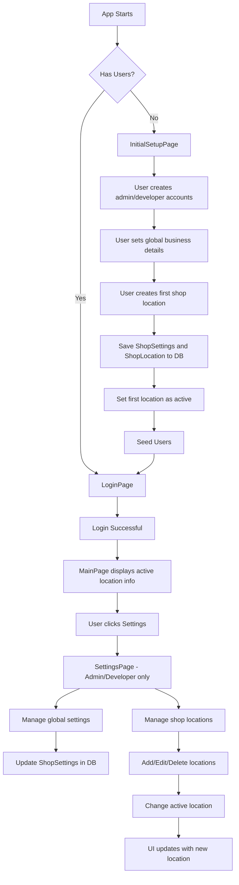
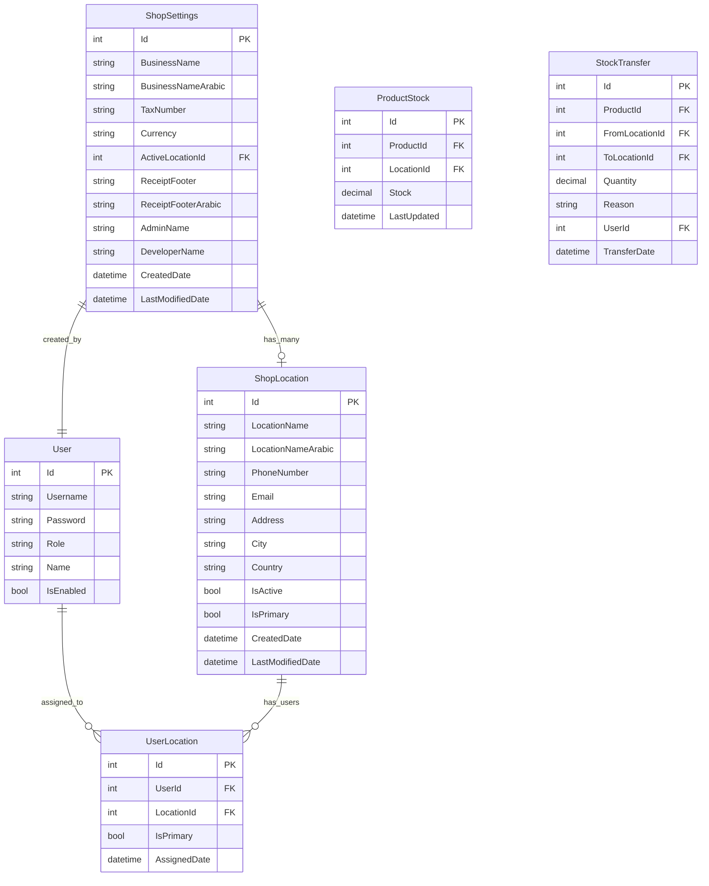
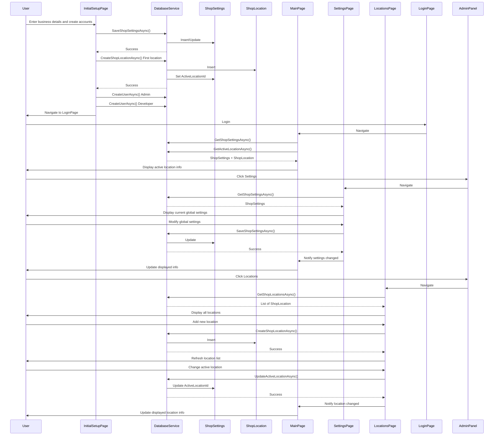

# Configurable Shop Settings with Multi-Location, Location-Specific Inventory, and Location-Specific Users

## Overview

This plan implements a configurable shop settings feature with multi-location support, location-specific inventory, and location-specific users. The feature enables:

1. **Developer account** to set shop details during initial setup (creates first location)
2. **Admin and Developer accounts** to modify shop settings and manage multiple locations after setup
3. Shop details (name, address, phone, etc.) displayed on the home page and login page
4. Shop details printed on receipts
5. Support for multiple shop locations/branches with active location selection
6. **Location-specific inventory** - each location has its own stock levels
7. Inventory operations (checkout, restock) affect only the active location's stock
8. Stock transfers between locations
9. **Location-specific users** - employees assigned to specific locations
10. User access restricted to their assigned location(s)

## Current State Analysis

### Existing Components
- [`MainPage.xaml`](SweetShopMa/Views/MainPage.xaml): Displays "🍬 Sweet Shop" as hardcoded title
- [`LoginPage.xaml`](SweetShopMa/Views/LoginPage.xaml): Displays "🍬 Sweet Shop" as hardcoded title
- [`DatabaseService.cs`](SweetShopMa/Services/DatabaseService.cs): Manages SQLite database with User, Product, Order, etc. tables
- [`SeedUsersAsync()`](SweetShopMa/Services/DatabaseService.cs): Creates default developer user (username: "ama", password: "AsrAma12@#")
- [`AuthService.cs`](SweetShopMa/Services/AuthService.cs): Handles authentication and role-based permissions
- [`AdminPage.xaml`](SweetShopMa/Views/AdminPage.xaml): Admin panel with management buttons

### User Roles
- **Developer**: Full access, can create users
- **Admin**: Can manage users, products, attendance, restock
- **Moderator**: Can manage stock, attendance, restock (but NOT users)
- **User**: Can only sell (use shop interface)

## Architecture Design

### Data Model: ShopSettings (Global Settings)

```csharp
public class ShopSettings
{
    [PrimaryKey]
    public int Id { get; set; } = 1; // Single row table, always ID=1

    // Global Business Information
    public string BusinessName { get; set; } = "Sweet Shop";
    public string BusinessNameArabic { get; set; } = "متجر حلويات";
    public string TaxNumber { get; set; } = "";
    public string Currency { get; set; } = "EGP"; // Default: Egyptian Pound

    // Active Location
    public int? ActiveLocationId { get; set; } = null; // Currently selected location

    // Receipt Settings
    public string ReceiptFooter { get; set; } = "Thank you for shopping with us!";
    public string ReceiptFooterArabic { get; set; } = "شكراً لتسوقكم معنا!";

    // Admin/Developer References
    public string AdminName { get; set; } = "";
    public string DeveloperName { get; set; } = "";

    // Timestamps
    public DateTime CreatedDate { get; set; } = DateTime.Now;
    public DateTime LastModifiedDate { get; set; } = DateTime.Now;
}
```

### Data Model: ProductStock (Location-Specific Inventory)

```csharp
public class ProductStock
{
    [PrimaryKey, AutoIncrement]
    public int Id { get; set; }

    // Foreign Keys
    public int ProductId { get; set; }
    public int LocationId { get; set; }

    // Stock Information
    public decimal Stock { get; set; } = 0m;

    // Timestamps
    public DateTime LastUpdated { get; set; } = DateTime.Now;

    // Navigation Properties (for SQLite relationships)
    [Ignore]
    public Product Product { get; set; }

    [Ignore]
    public ShopLocation Location { get; set; }
}
```

### Data Model: UserLocation (User-Location Assignment)

```csharp
public class UserLocation
{
    [PrimaryKey, AutoIncrement]
    public int Id { get; set; }

    // Foreign Keys
    public int UserId { get; set; }
    public int LocationId { get; set; }

    // Assignment Metadata
    public bool IsPrimary { get; set; } = false; // User's primary location for login
    public DateTime AssignedDate { get; set; } = DateTime.Now;

    // Navigation Properties
    [Ignore]
    public User User { get; set; }

    [Ignore]
    public ShopLocation Location { get; set; }
}
```

### Data Model: StockTransfer (Inventory Movement Between Locations)

```csharp
public class StockTransfer
{
    [PrimaryKey, AutoIncrement]
    public int Id { get; set; }

    // Transfer Details
    public int ProductId { get; set; }
    public int FromLocationId { get; set; }
    public int ToLocationId { get; set; }
    public decimal Quantity { get; set; }

    // Transfer Metadata
    public string Reason { get; set; } = ""; // e.g., "Restock", "Transfer", "Adjustment"
    public int? UserId { get; set; } = null; // User who performed the transfer
    public DateTime TransferDate { get; set; } = DateTime.Now;

    // Navigation Properties
    [Ignore]
    public Product Product { get; set; }

    [Ignore]
    public ShopLocation FromLocation { get; set; }

    [Ignore]
    public ShopLocation ToLocation { get; set; }

    [Ignore]
    public User User { get; set; }
}
```

### Data Model: ShopLocation (Multiple Locations)

```csharp
public class ShopLocation
{
    [PrimaryKey, AutoIncrement]
    public int Id { get; set; }

    // Location Identification
    public string LocationName { get; set; } = ""; // e.g., "Main Branch", "Downtown"
    public string LocationNameArabic { get; set; } = "";

    // Contact Information
    public string PhoneNumber { get; set; } = "";
    public string Email { get; set; } = "";

    // Address Information
    public string Address { get; set; } = "";
    public string City { get; set; } = "";
    public string Country { get; set; } = "";

    // Location Status
    public bool IsActive { get; set; } = true;
    public bool IsPrimary { get; set; } = false; // First location is primary

    // Timestamps
    public DateTime CreatedDate { get; set; } = DateTime.Now;
    public DateTime LastModifiedDate { get; set; } = DateTime.Now;
}
```

### System Flow



### Database Schema



## Implementation Steps

### Step 1: Create ShopSettings, ShopLocation, ProductStock, StockTransfer, and UserLocation Models

**Files:**
- `SweetShopMa/Models/ShopSettings.cs` - Global shop settings
- `SweetShopMa/Models/ShopLocation.cs` - Individual shop locations
- `SweetShopMa/Models/ProductStock.cs` - Location-specific inventory
- `SweetShopMa/Models/StockTransfer.cs` - Stock transfer history
- `SweetShopMa/Models/UserLocation.cs` - User-location assignments

**ShopSettings.cs:**
```csharp
using SQLite;

namespace SweetShopMa.Models;

public class ShopSettings
{
    [PrimaryKey]
    public int Id { get; set; } = 1; // Single row table

    // Global Business Information
    public string BusinessName { get; set; } = "Sweet Shop";
    public string BusinessNameArabic { get; set; } = "متجر حلويات";
    public string TaxNumber { get; set; } = "";
    public string Currency { get; set; } = "EGP"; // Default: Egyptian Pound

    // Active Location
    public int? ActiveLocationId { get; set; } = null;

    // Receipt Settings
    public string ReceiptFooter { get; set; } = "Thank you for shopping with us!";
    public string ReceiptFooterArabic { get; set; } = "شكراً لتسوقكم معنا!";

    // Admin/Developer References
    public string AdminName { get; set; } = "";
    public string DeveloperName { get; set; } = "";

    // Timestamps
    public DateTime CreatedDate { get; set; } = DateTime.Now;
    public DateTime LastModifiedDate { get; set; } = DateTime.Now;
}
```

**ShopLocation.cs:**
```csharp
using SQLite;

namespace SweetShopMa.Models;

public class ShopLocation
{
    [PrimaryKey, AutoIncrement]
    public int Id { get; set; }

    // Location Identification
    public string LocationName { get; set; } = "";
    public string LocationNameArabic { get; set; } = "";

    // Contact Information
    public string PhoneNumber { get; set; } = "";
    public string Email { get; set; } = "";

    // Address Information
    public string Address { get; set; } = "";
    public string City { get; set; } = "";
    public string Country { get; set; } = "";

    // Location Status
    public bool IsActive { get; set; } = true;
    public bool IsPrimary { get; set; } = false;

    // Timestamps
    public DateTime CreatedDate { get; set; } = DateTime.Now;
    public DateTime LastModifiedDate { get; set; } = DateTime.Now;
}
```

**ProductStock.cs:**
```csharp
using SQLite;

namespace SweetShopMa.Models;

public class ProductStock
{
    [PrimaryKey, AutoIncrement]
    public int Id { get; set; }

    // Foreign Keys
    public int ProductId { get; set; }
    public int LocationId { get; set; }

    // Stock Information
    public decimal Stock { get; set; } = 0m;

    // Timestamps
    public DateTime LastUpdated { get; set; } = DateTime.Now;

    // Navigation Properties (for SQLite relationships)
    [Ignore]
    public Product Product { get; set; }

    [Ignore]
    public ShopLocation Location { get; set; }
}
```

**StockTransfer.cs:**
```csharp
using SQLite;

namespace SweetShopMa.Models;

public class StockTransfer
{
    [PrimaryKey, AutoIncrement]
    public int Id { get; set; }

    // Transfer Details
    public int ProductId { get; set; }
    public int FromLocationId { get; set; }
    public int ToLocationId { get; set; }
    public decimal Quantity { get; set; }

    // Transfer Metadata
    public string Reason { get; set; } = "";
    public int? UserId { get; set; } = null;
    public DateTime TransferDate { get; set; } = DateTime.Now;

    // Navigation Properties
    [Ignore]
    public Product Product { get; set; }

    [Ignore]
    public ShopLocation FromLocation { get; set; }

    [Ignore]
    public ShopLocation ToLocation { get; set; }

    [Ignore]
    public User User { get; set; }
}
```

**UserLocation.cs:**
```csharp
using SQLite;

namespace SweetShopMa.Models;

public class UserLocation
{
    [PrimaryKey, AutoIncrement]
    public int Id { get; set; }

    // Foreign Keys
    public int UserId { get; set; }
    public int LocationId { get; set; }

    // Assignment Metadata
    public bool IsPrimary { get; set; } = false;
    public DateTime AssignedDate { get; set; } = DateTime.Now;

    // Navigation Properties
    [Ignore]
    public User User { get; set; }

    [Ignore]
    public ShopLocation Location { get; set; }
}
```

### Step 2: Add ShopSettings, ShopLocation, ProductStock, StockTransfer, and UserLocation Tables to DatabaseService

**File:** `SweetShopMa/Services/DatabaseService.cs`

**Changes required:**

1. Create `ShopSettings` table in [`InitializeAsync()`](SweetShopMa/Services/DatabaseService.cs:105)
2. Create `ShopLocation` table in [`InitializeAsync()`](SweetShopMa/Services/DatabaseService.cs:105)
3. Create `ProductStock` table in [`InitializeAsync()`](SweetShopMa/Services/DatabaseService.cs:105)
4. Create `StockTransfer` table in [`InitializeAsync()`](SweetShopMa/Services/DatabaseService.cs:105)
5. Create `UserLocation` table in [`InitializeAsync()`](SweetShopMa/Services/DatabaseService.cs:105)

6. Add ShopSettings CRUD methods:
   - `GetShopSettingsAsync()` - Get settings (create default if not exists)
   - `SaveShopSettingsAsync(ShopSettings settings)` - Save/update settings
   - `UpdateActiveLocationAsync(int locationId)` - Set active location

7. Add ShopLocation CRUD methods:
   - `GetShopLocationsAsync()` - Get all locations
   - `GetActiveLocationAsync()` - Get currently active location
   - `CreateShopLocationAsync(ShopLocation location)` - Create new location
   - `UpdateShopLocationAsync(ShopLocation location)` - Update location
   - `DeleteShopLocationAsync(ShopLocation location)` - Delete location
   - `SetPrimaryLocationAsync(int locationId)` - Set a location as primary

8. Add ProductStock CRUD methods:
   - `GetProductStockAsync(int productId, int locationId)` - Get stock for product at location
   - `GetAllProductStockAsync(int productId)` - Get stock for product across all locations
   - `UpdateProductStockAsync(int productId, int locationId, decimal quantity)` - Update stock
   - `GetLocationStockAsync(int locationId)` - Get all stock for a location
   - `InitializeProductStockAsync(int productId, int locationId)` - Create stock entry for new product/location

9. Add StockTransfer CRUD methods:
   - `CreateStockTransferAsync(StockTransfer transfer)` - Record stock transfer
   - `GetStockTransfersAsync(int productId, DateTime? start, DateTime? end)` - Get transfer history
   - `ExecuteStockTransferAsync(StockTransfer transfer)` - Execute transfer between locations

10. Add UserLocation CRUD methods:
    - `GetUserLocationsAsync(int userId)` - Get all locations assigned to user
    - `GetUserPrimaryLocationAsync(int userId)` - Get user's primary location
    - `AssignUserToLocationAsync(int userId, int locationId, bool isPrimary)` - Assign user to location
    - `RemoveUserFromLocationAsync(int userId, int locationId)` - Remove user from location
    - `GetLocationUsersAsync(int locationId)` - Get all users assigned to location

**Implementation notes:**
- Add table creation calls after line 143 in [`InitializeAsync()`](SweetShopMa/Services/DatabaseService.cs:105)
- All CRUD methods should call `await InitializeAsync()` first
- Use transactions for multi-step operations (e.g., stock transfer)

### Step 3: Create InitialSetupPage

**File:** `SweetShopMa/Views/InitialSetupPage.xaml` and `.xaml.cs`

**Features:**
- Global business name input (English and Arabic)
- Business information (tax number, currency)
- Receipt footer (English and Arabic)
- First location setup (location name, address, phone, email)
- Admin account creation fields
- Developer account creation fields
- Setup button to save settings and create users
- Language selector (EN/AR)

**Note:** First location created during setup is automatically set as primary and active. All existing products will have stock entries created for this location.

### Step 4: Modify LoginPage and User Model for Location Assignment

**Files:** `SweetShopMa/Views/LoginPage.xaml.cs` and `SweetShopMa/Models/User.cs`

**Changes to LoginPage.xaml.cs:**
- In [`OnAppearing()`](SweetShopMa/Views/LoginPage.xaml.cs), check if users exist
- If no users, navigate to `InitialSetupPage`
- Load business name from [`ShopSettings`](SweetShopMa/Models/ShopSettings.cs) and display in title
- On login, check if user has assigned locations
- If user has multiple locations, show location selector
- If user has one location, auto-select that location
- If user has no locations, show error message

**Changes to User.cs:**
- Add `LocationId` property for current location during session
- Add `AssignedLocations` collection (computed from [`UserLocation`](SweetShopMa/Models/UserLocation.cs) table)
- Add `CanAccessLocation(int locationId)` method to check user access

### Step 5: Create SettingsPage

**File:** `SweetShopMa/Views/SettingsPage.xaml` and `.xaml.cs`

**Features:**
- Global settings section:
  - Business name edit (English and Arabic)
  - Business information (tax number, currency)
  - Receipt footer edit (English and Arabic)
- Locations management section:
  - List of all shop locations
  - Add new location button
  - Edit location button
  - Delete location button (cannot delete active location)
  - Set active location button
  - Location details: name, address, phone, email, city, country
- Admin name display (read-only)
- Developer name display (read-only)
- Save button
- Only accessible to Admin and Developer roles
- Language selector (EN/AR)

**Additional Pages:**
- `ShopLocationsPage.xaml` - Dedicated page for managing locations
- `UserLocationsPage.xaml` - Page for managing user-location assignments
- `StockTransferPage.xaml` - Page for transferring stock between locations

### Step 6: Update MainPage and ShopViewModel

**File:** `SweetShopMa/Views/MainPage.xaml`, `SweetShopMa/Views/MainPage.xaml.cs`, and `SweetShopMa/ViewModels/ShopViewModel.cs`

**Changes:**
- Bind title to active location name from [`ShopSettings`](SweetShopMa/Models/ShopSettings.cs) + [`ShopLocation`](SweetShopMa/Models/ShopLocation.cs)
- Display active location contact info (phone, email, address) in header or sidebar
- Add location switcher dropdown/button (if multiple locations exist)
- Load settings and active location in [`OnAppearing()`](SweetShopMa/Views/MainPage.xaml.cs)
- **Update ShopViewModel to use location-specific stock:**
  - Modify `GetProductsAsync()` to join with [`ProductStock`](SweetShopMa/Models/ProductStock.cs) for active location
  - Update stock display to show location-specific stock
  - Modify checkout to deduct from active location's [`ProductStock`](SweetShopMa/Models/ProductStock.cs)
  - Modify restock to add to active location's [`ProductStock`](SweetShopMa/Models/ProductStock.cs)

**Optional Enhancement:** Add a footer section displaying:
- Active location phone number
- Active location email
- Active location address
- Currency symbol from global settings

### Step 7: Create UserLocationsPage for Managing User-Location Assignments

**File:** `SweetShopMa/Views/UserLocationsPage.xaml` and `.xaml.cs`

**Features:**
- List all users with their assigned locations
- Assign user to location (Admin/Developer only)
- Remove user from location (Admin/Developer only)
- Set user's primary location (Admin/Developer only)
- View location's assigned users
- Only accessible to Admin and Developer roles
- Language selector (EN/AR)

### Step 8: Create StockTransferPage for Transferring Stock Between Locations

**File:** `SweetShopMa/Views/StockTransferPage.xaml` and `.xaml.cs`

**Features:**
- Select product to transfer
- Select source location
- Select destination location
- Enter quantity to transfer
- Add reason for transfer (optional)
- Transfer button
- View transfer history
- Only accessible to Admin and Developer roles
- Language selector (EN/AR)

### Step 9: Add Navigation Routes

**File:** `SweetShopMa/AppShell.xaml`

**Add:**
```xml
<ShellContent
    Title="Initial Setup"
    ContentTemplate="{DataTemplate local:InitialSetupPage}"
    Route="initialsetup" />

<ShellContent
    Title="Settings"
    ContentTemplate="{DataTemplate local:SettingsPage}"
    Route="settings" />

<ShellContent
    Title="Shop Locations"
    ContentTemplate="{DataTemplate local:ShopLocationsPage}"
    Route="locations" />

<ShellContent
    Title="User Locations"
    ContentTemplate="{DataTemplate local:UserLocationsPage}"
    Route="userlocations" />

<ShellContent
    Title="Stock Transfer"
    ContentTemplate="{DataTemplate local:StockTransferPage}"
    Route="stocktransfer" />
```

### Step 10: Add Settings and Stock Transfer Buttons to AdminPanel

**File:** `SweetShopMa/Views/AdminPage.xaml`

**Add new cards:**
```xml
<!-- Settings Management Button -->
<Border Grid.Row="2" Grid.Column="1"
        Stroke="#9C27B0"
        StrokeThickness="2"
        Padding="20"
        BackgroundColor="#f0f9fa"
        IsVisible="{Binding CanManageUsers}">
    <Border.StrokeShape>
        <RoundRectangle CornerRadius="12"/>
    </Border.StrokeShape>
    <Border.GestureRecognizers>
        <TapGestureRecognizer Tapped="OnSettingsTapped"/>
    </Border.GestureRecognizers>
    <VerticalStackLayout Spacing="10" HorizontalOptions="Center">
        <Label Text="⚙️" FontSize="48" HorizontalOptions="Center"/>
        <Label Text="Shop Settings"
               FontSize="18"
               FontAttributes="Bold"
               TextColor="#9C27B0"
               HorizontalOptions="Center"/>
        <Label Text="Configure shop name and settings"
               FontSize="12"
               TextColor="#666"
               HorizontalOptions="Center"
               HorizontalTextAlignment="Center"/>
    </VerticalStackLayout>
</Border>

<!-- Shop Locations Management Button -->
<Border Grid.Row="2" Grid.Column="0"
        Stroke="#FF5722"
        StrokeThickness="2"
        Padding="20"
        BackgroundColor="#f0f9fa"
        IsVisible="{Binding CanManageUsers}">
    <Border.StrokeShape>
        <RoundRectangle CornerRadius="12"/>
    </Border.StrokeShape>
    <Border.GestureRecognizers>
        <TapGestureRecognizer Tapped="OnLocationsTapped"/>
    </Border.GestureRecognizers>
    <VerticalStackLayout Spacing="10" HorizontalOptions="Center">
        <Label Text="📍" FontSize="48" HorizontalOptions="Center"/>
        <Label Text="Shop Locations"
               FontSize="18"
               FontAttributes="Bold"
               TextColor="#FF5722"
               HorizontalOptions="Center"/>
        <Label Text="Manage multiple shop branches"
               FontSize="12"
               TextColor="#666"
               HorizontalOptions="Center"
               HorizontalTextAlignment="Center"/>
    </VerticalStackLayout>
</Border>

<!-- Stock Transfer Button -->
<Border Grid.Row="3" Grid.Column="0" Grid.ColumnSpan="2"
        Stroke="#607D8B"
        StrokeThickness="2"
        Padding="20"
        BackgroundColor="#f0f9fa"
        IsVisible="{Binding CanManageStock}">
    <Border.StrokeShape>
        <RoundRectangle CornerRadius="12"/>
    </Border.StrokeShape>
    <Border.GestureRecognizers>
        <TapGestureRecognizer Tapped="OnStockTransferTapped"/>
    </Border.GestureRecognizers>
    <VerticalStackLayout Spacing="10" HorizontalOptions="Center">
        <Label Text="📦" FontSize="48" HorizontalOptions="Center"/>
        <Label Text="Stock Transfer"
               FontSize="18"
               FontAttributes="Bold"
               TextColor="#607D8B"
               HorizontalOptions="Center"/>
        <Label Text="Transfer inventory between locations"
               FontSize="12"
               TextColor="#666"
               HorizontalOptions="Center"
               HorizontalTextAlignment="Center"/>
    </VerticalStackLayout>
</Border>
```

### Step 11: Add Localization Strings

**File:** `SweetShopMa/Resources/Strings.resx` and `Strings.ar.resx`

**Add keys:**
- `InitialSetup` / `InitialSetupAr`
- `BusinessName` / `BusinessNameAr`
- `BusinessNameArabic` / `BusinessNameArabicAr`
- `LocationName` / `LocationNameAr`
- `LocationNameArabic` / `LocationNameArabicAr`
- `PhoneNumber` / `PhoneNumberAr`
- `Email` / `EmailAr`
- `Address` / `AddressAr`
- `City` / `CityAr`
- `Country` / `CountryAr`
- `TaxNumber` / `TaxNumberAr`
- `Currency` / `CurrencyAr`
- `ReceiptFooter` / `ReceiptFooterAr`
- `CreateAdmin` / `CreateAdminAr`
- `CreateDeveloper` / `CreateDeveloperAr`
- `SetupShop` / `SetupShopAr`
- `ShopSettings` / `ShopSettingsAr`
- `ShopLocations` / `ShopLocationsAr`
- `AddLocation` / `AddLocationAr`
- `EditLocation` / `EditLocationAr`
- `DeleteLocation` / `DeleteLocationAr`
- `SetActiveLocation` / `SetActiveLocationAr`
- `SaveSettings` / `SaveSettingsAr`
- `SettingsSaved` / `SettingsSavedAr`
- `ContactInfo` / `ContactInfoAr`
- `BusinessInfo` / `BusinessInfoAr`
- `ReceiptSettings` / `ReceiptSettingsAr`
- `LocationSettings` / `LocationSettingsAr`
- `ActiveLocation` / `ActiveLocationAr`
- `UserLocations` / `UserLocationsAr`
- `AssignUser` / `AssignUserAr`
- `RemoveUser` / `RemoveUserAr`
- `SetPrimaryLocation` / `SetPrimaryLocationAr`
- `StockTransfer` / `StockTransferAr`
- `TransferStock` / `TransferStockAr`
- `FromLocation` / `FromLocationAr`
- `ToLocation` / `ToLocationAr`
- `TransferReason` / `TransferReasonAr`
- `TransferHistory` / `TransferHistoryAr`

### Step 12: Create ViewModels

**Files:**
- `SweetShopMa/ViewModels/SettingsViewModel.cs` - Settings view model
- `SweetShopMa/ViewModels/InitialSetupViewModel.cs` - Initial setup view model
- `SweetShopMa/ViewModels/LocationsViewModel.cs` - Locations view model
- `SweetShopMa/ViewModels/UserLocationsViewModel.cs` - User-locations view model
- `SweetShopMa/ViewModels/StockTransferViewModel.cs` - Stock transfer view model

**SettingsViewModel.cs Features:**
- Load shop settings from database
- Save shop settings to database
- Notify UI when settings change
- Permission checks (Admin/Developer only)

## Data Flow Diagram



## File Changes Summary

### New Files
1. `SweetShopMa/Models/ShopSettings.cs` - Global shop settings data model
2. `SweetShopMa/Models/ShopLocation.cs` - Shop location data model
3. `SweetShopMa/Models/ProductStock.cs` - Location-specific inventory data model
4. `SweetShopMa/Models/StockTransfer.cs` - Stock transfer history data model
5. `SweetShopMa/Models/UserLocation.cs` - User-location assignment data model
6. `SweetShopMa/Views/InitialSetupPage.xaml` - Initial setup UI
7. `SweetShopMa/Views/InitialSetupPage.xaml.cs` - Initial setup code-behind
8. `SweetShopMa/Views/SettingsPage.xaml` - Settings UI
9. `SweetShopMa/Views/SettingsPage.xaml.cs` - Settings code-behind
10. `SweetShopMa/Views/ShopLocationsPage.xaml` - Locations management UI
11. `SweetShopMa/Views/ShopLocationsPage.xaml.cs` - Locations management code-behind
12. `SweetShopMa/Views/UserLocationsPage.xaml` - User-location assignment UI
13. `SweetShopMa/Views/UserLocationsPage.xaml.cs` - User-location assignment code-behind
14. `SweetShopMa/Views/StockTransferPage.xaml` - Stock transfer UI
15. `SweetShopMa/Views/StockTransferPage.xaml.cs` - Stock transfer code-behind
16. `SweetShopMa/ViewModels/SettingsViewModel.cs` - Settings view model
17. `SweetShopMa/ViewModels/InitialSetupViewModel.cs` - Initial setup view model
18. `SweetShopMa/ViewModels/LocationsViewModel.cs` - Locations view model
19. `SweetShopMa/ViewModels/UserLocationsViewModel.cs` - User-locations view model
20. `SweetShopMa/ViewModels/StockTransferViewModel.cs` - Stock transfer view model

### Modified Files
1. `SweetShopMa/Services/DatabaseService.cs` - Add ShopSettings, ShopLocation, ProductStock, StockTransfer, and UserLocation tables with CRUD methods
2. `SweetShopMa/Models/User.cs` - Add LocationId property and location access methods
3. `SweetShopMa/Views/LoginPage.xaml.cs` - Add initial setup redirect, business name display, and location selector
4. `SweetShopMa/Views/MainPage.xaml` - Bind title to active location name
5. `SweetShopMa/Views/MainPage.xaml.cs` - Load shop settings and active location
6. `SweetShopMa/ViewModels/ShopViewModel.cs` - Update to use location-specific stock
7. `SweetShopMa/Views/AdminPage.xaml` - Add Settings, Locations, and Stock Transfer buttons
8. `SweetShopMa/Views/AdminPage.xaml.cs` - Add Settings, Locations, and Stock Transfer navigation handlers
9. `SweetShopMa/AppShell.xaml` - Add navigation routes for InitialSetup, Settings, Locations, UserLocations, and Stock Transfer
10. `SweetShopMa/Resources/Strings.resx` - Add English localization strings
11. `SweetShopMa/Resources/Strings.ar.resx` - Add Arabic localization strings

## Security Considerations

1. **Initial Setup**: Only runs when database has no users (prevents bypass)
2. **Settings Access**: Restricted to Admin and Developer roles only
3. **Location Access**: Restricted to Admin and Developer roles only
4. **User-Location Access**: Users can only access their assigned locations
5. **Location-Specific Inventory**: Users can only view/modify stock at their assigned locations
6. **Input Validation**: Validate shop name length and content
7. **Database Constraints**: ShopSettings table has single row (Id=1)
8. **User Assignment**: Users without location assignments cannot access any location
9. **Primary Location**: User's primary location is auto-selected on login
10. **Stock Transfer**: Only users with access to both locations can transfer stock

## Testing Checklist

### Initial Setup
- [ ] Initial setup page appears when no users exist
- [ ] Can create admin and developer accounts in initial setup
- [ ] Business name (EN/AR) is saved correctly in initial setup
- [ ] First location is created automatically during setup
- [ ] First location is set as primary and active
- [ ] Location details (name, address, phone, email, city, country) are saved correctly
- [ ] Tax number is saved correctly in initial setup
- [ ] Currency is saved correctly in initial setup
- [ ] Receipt footer (EN/AR) is saved correctly in initial setup

### Display
- [ ] After initial setup, login page displays correct business name
- [ ] Main page displays correct business name
- [ ] Main page displays active location name
- [ ] Main page displays active location contact info (phone, email, address)
- [ ] Currency symbol is displayed correctly throughout the app

### Settings Page
- [ ] Settings page is accessible to Admin
- [ ] Settings page is accessible to Developer
- [ ] Settings page is NOT accessible to Moderator
- [ ] Settings page is NOT accessible to User
- [ ] Business name changes update display on all pages
- [ ] Tax number and currency changes are saved correctly
- [ ] Receipt footer changes are saved correctly
- [ ] Language switching works correctly on settings page
- [ ] RTL layout works correctly for Arabic

### Locations Management
- [ ] Locations page is accessible to Admin
- [ ] Locations page is accessible to Developer
- [ ] Locations page is NOT accessible to Moderator
- [ ] Locations page is NOT accessible to User
- [ ] Can add new location
- [ ] Can edit existing location
- [ ] Can delete location (except active location)
- [ ] Can change active location
- [ ] Active location change updates display on all pages
- [ ] Cannot delete the only remaining location
- [ ] Location details are saved correctly
- [ ] Language switching works correctly on locations page
- [ ] RTL layout works correctly for Arabic

### Location-Specific Inventory
- [ ] Products show correct stock for active location
- [ ] Checkout deducts from active location's stock
- [ ] Restock adds to active location's stock
- [ ] Stock changes do not affect other locations
- [ ] New products get stock entries for all locations
- [ ] New locations get stock entries for all products

### Stock Transfer
- [ ] Stock transfer page is accessible to Admin
- [ ] Stock transfer page is accessible to Developer
- [ ] Stock transfer page is NOT accessible to Moderator
- [ ] Stock transfer page is NOT accessible to User
- [ ] Can transfer stock between locations
- [ ] Source location stock decreases
- [ ] Destination location stock increases
- [ ] Transfer history is recorded
- [ ] Cannot transfer more stock than available
- [ ] Cannot transfer to same location
- [ ] Language switching works correctly on stock transfer page
- [ ] RTL layout works correctly for Arabic

### User-Location Assignment
- [ ] User locations page is accessible to Admin
- [ ] User locations page is accessible to Developer
- [ ] User locations page is NOT accessible to Moderator
- [ ] User locations page is NOT accessible to User
- [ ] Can assign user to location
- [ ] Can remove user from location
- [ ] Can set user's primary location
- [ ] User can only access assigned locations
- [ ] User with multiple locations sees location selector on login
- [ ] User with single location auto-selects that location
- [ ] User with no locations shows error message
- [ ] Language switching works correctly on user locations page
- [ ] RTL layout works correctly for Arabic

### Data Persistence
- [ ] Database persists all shop settings across app restarts
- [ ] Database persists all locations across app restarts
- [ ] Active location selection persists across app restarts
- [ ] Receipt generation uses active location settings (name, address, phone, footer)
- [ ] User-location assignments persist across app restarts
- [ ] Stock levels persist across app restarts
- [ ] Stock transfer history persists across app restarts
