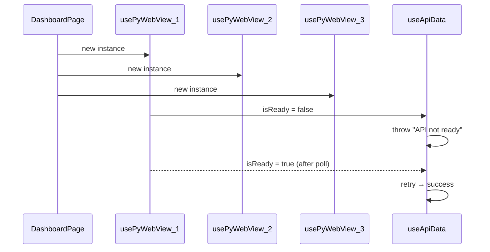
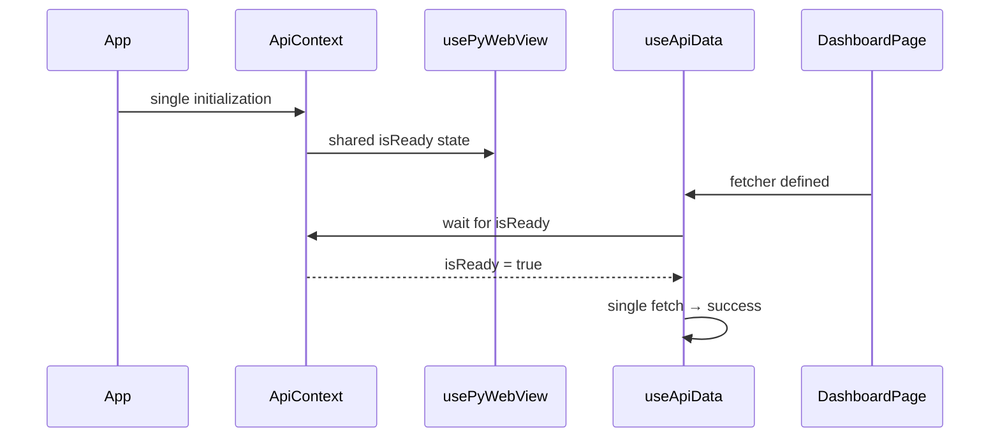

# PyWebView API Initialization Optimization Plan

## Problem Statement
The debug logs show early "API not ready" errors during application initialization. This occurs because:
- Multiple hooks initialize simultaneously during first render
- Each `usePyWebView()` instance starts independent polling
- Data fetching hooks attempt to call APIs before `isReady = true`

## Current Behavior
```
usePyWebView() × 6 instances (one per data hook)
    ↓
Each starts polling for window.pywebview.api
    ↓
Data hooks check isReady → false → throw "API not ready"
    ↓
Polling succeeds → isReady = true → hooks retry → success
```

## Proposed Solution

### Option 1: Singleton API Context (Recommended)
Create a shared API context that:
- Initializes once at app level
- Provides a single `isReady` state to all hooks
- Eliminates redundant polling instances

### Option 2: Debounced Fetch with Retry
Modify `useApiData` to:
- Wait for `isReady` before attempting fetch
- Add exponential backoff retry logic
- Suppress errors during initialization window

### Option 3: Global Loading State
Add a global `apiInitializing` state that:
- Shows a unified loading screen
- Prevents any data fetching until ready
- Provides better UX during initialization

## Implementation Plan

### Phase 1: Singleton API Context ✅ COMPLETED
- [x] Create `ApiContext.jsx` to wrap the app
- [x] Move `usePyWebView()` logic to context provider
- [x] Update all hooks to consume from context
- [x] Result: Single polling instance instead of 6+

### Phase 2: Loading State Improvements ✅ COMPLETED
- [x] Add global loading overlay component
- [x] Update `AppLayout` to show loading during API init
- [x] Suppress "API not ready" errors when initializing

### Phase 3: Retry Logic Enhancement
- [ ] Add exponential backoff to `useApiData`
- [ ] Add circuit breaker pattern for persistent failures
- [ ] Add user-friendly error messages

### Phase 3: Retry Logic Enhancement
- [ ] Add exponential backoff to `useApiData`
- [ ] Add circuit breaker pattern for persistent failures
- [ ] Add user-friendly error messages

## Files to Modify

1. **`sweetshopma-desktop/frontend/src/context/ApiContext.jsx`** (NEW)
   - Singleton API context provider
   - Shared polling state

2. **`sweetshopma-desktop/frontend/src/hooks/usePyWebView.js`** (MODIFY)
   - Consume from ApiContext instead of local state

3. **`sweetshopma-desktop/frontend/src/services/apiService.js`** (MODIFY)
   - Consume from ApiContext

4. **`sweetshopma-desktop/frontend/src/components/layout/AppLayout.jsx`** (MODIFY)
   - Add API initialization loading state

5. **`sweetshopma-desktop/frontend/src/App.jsx`** (MODIFY)
   - Wrap app with ApiContext

## Mermaid: Current vs Proposed Flow

### Current Flow


### Proposed Flow


## Priority

1. **High**: Singleton API Context - Reduces redundant polling
2. **Medium**: Loading State Improvements - Better UX
3. **Low**: Retry Logic - Edge case handling

## Estimated Effort

- Phase 1: 2-3 hours
- Phase 2: 1-2 hours
- Phase 3: 2-3 hours

## Success Criteria

- [ ] No "API not ready" errors in console during normal operation
- [ ] Single polling instance instead of multiple
- [ ] Unified loading state during API initialization
- [ ] Graceful handling of API failures
