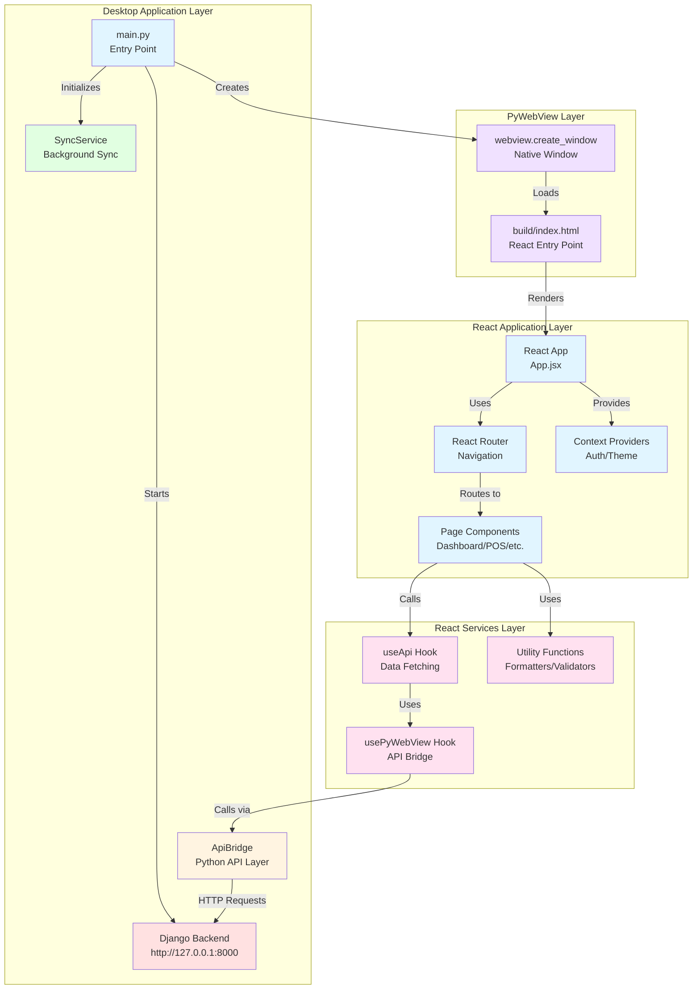
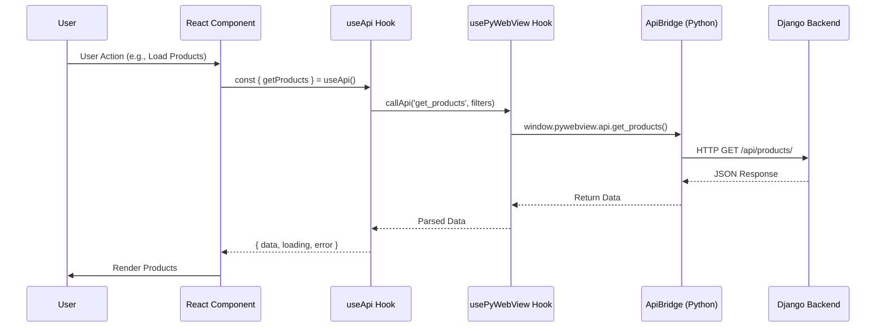
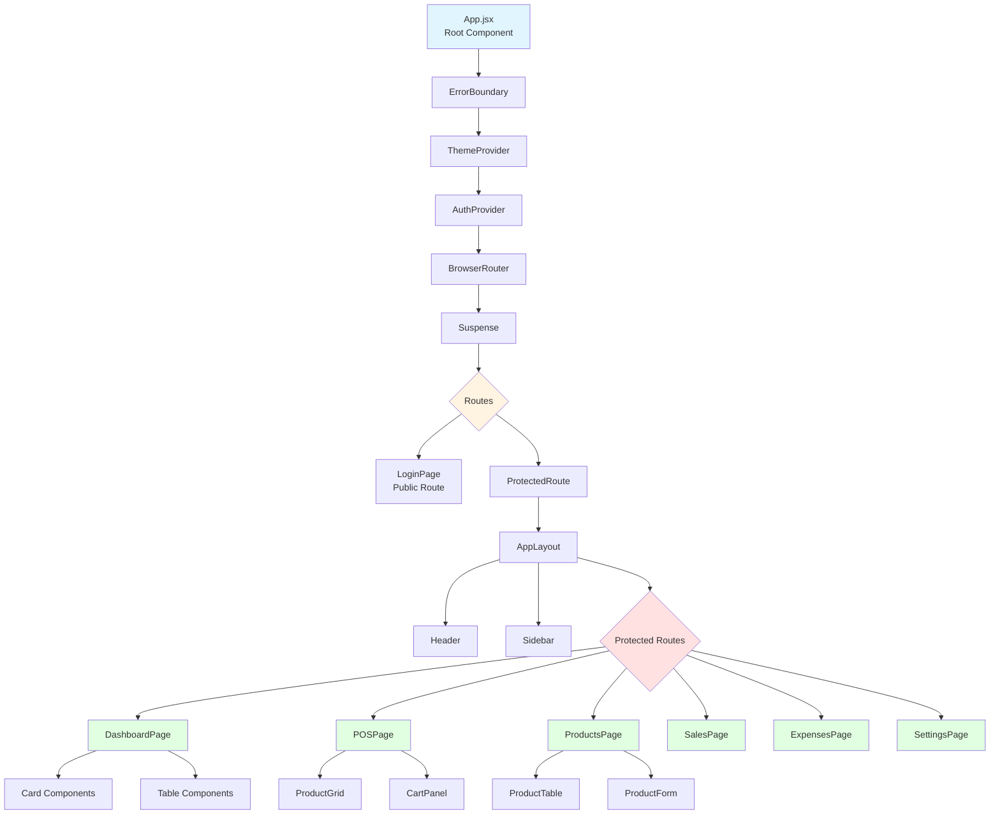
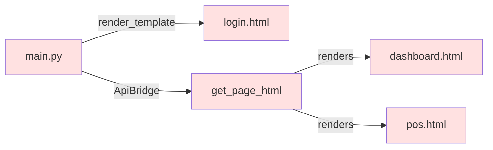
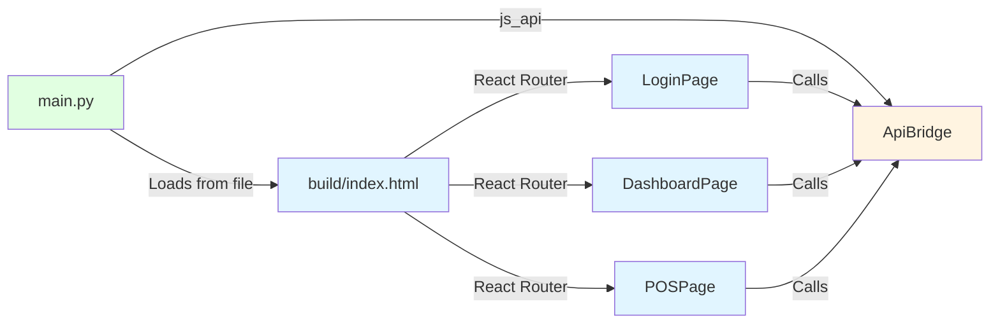
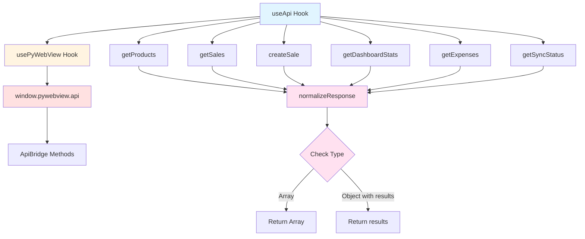
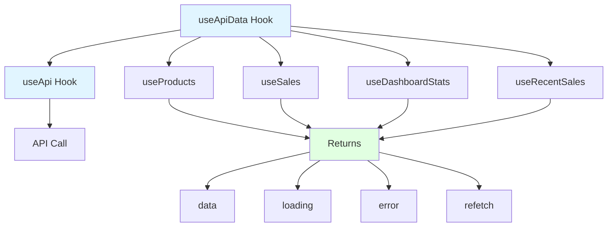
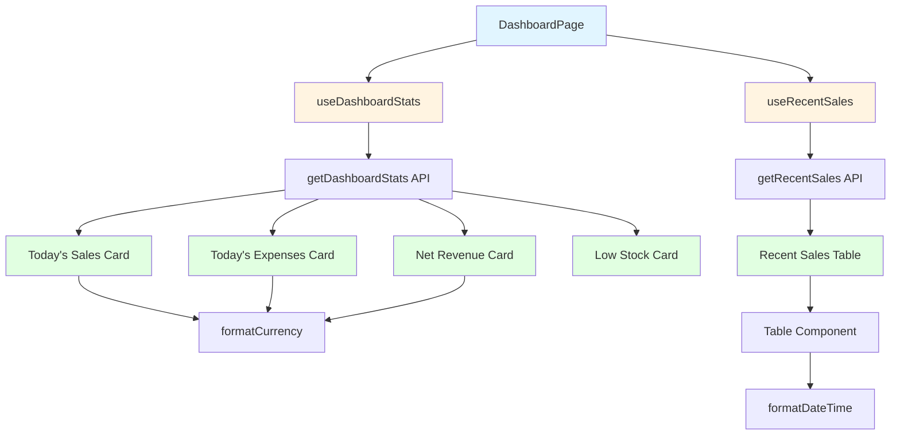
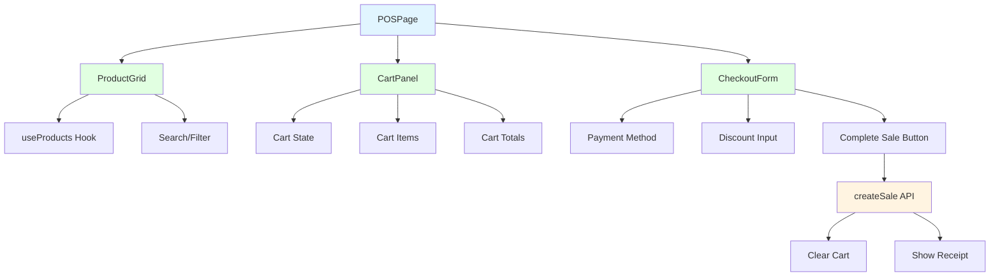

# PyWebView React Architecture Diagram

## System Architecture Overview



## Data Flow Diagram



## Component Hierarchy



## Phase 0: PyWebView Integration

### Current State (Template-Based)



### Target State (React-Based)



## Phase 2: Core Infrastructure

### API Service Layer



### Data Fetching Hooks



## Phase 3: Page Migration

### Dashboard Page Data Flow



### POS Page Component Structure



## File Structure After Migration

```
sweetshopma-desktop/frontend/
├── build/                          # Built React app (loaded by PyWebView)
│   ├── index.html                  # Entry point
│   └── assets/                     # JS/CSS bundles
│       ├── index-*.js
│       ├── index-*.css
│       └── *Page-*.js              # Lazy-loaded page chunks
├── src/
│   ├── components/
│   │   ├── common/
│   │   │   ├── Button.jsx          # NEW
│   │   │   ├── Input.jsx           # NEW
│   │   │   ├── Card.jsx            # NEW
│   │   │   ├── Table.jsx           # NEW
│   │   │   ├── ErrorBoundary.jsx   # Existing
│   │   │   └── LoadingSpinner.jsx  # Existing
│   │   └── layout/
│   │       ├── AppLayout.jsx       # Existing
│   │       ├── Header.jsx          # Existing
│   │       └── Sidebar.jsx         # Existing
│   ├── context/
│   │   ├── AuthContext.jsx         # Existing - Update with real auth
│   │   └── ThemeContext.jsx        # Existing
│   ├── hooks/
│   │   ├── usePyWebView.js         # NEW - PyWebView bridge
│   │   └── useApiData.js           # NEW - Data fetching hooks
│   ├── pages/
│   │   ├── LoginPage.jsx           # Update - Real auth
│   │   ├── DashboardPage.jsx       # Update - Real data
│   │   ├── POSPage.jsx             # Update - Full functionality
│   │   ├── ProductsPage.jsx        # Update - CRUD operations
│   │   ├── SalesPage.jsx           # Update - History and details
│   │   ├── ExpensesPage.jsx        # Update - CRUD operations
│   │   └── SettingsPage.jsx        # Update - Configuration
│   ├── services/
│   │   └── apiService.js           # NEW - API service layer
│   ├── styles/
│   │   ├── global.css              # Existing - Add component styles
│   │   └── variables.css           # Existing
│   ├── utils/
│   │   ├── formatters.js           # NEW - Format functions
│   │   ├── validators.js           # NEW - Validation functions
│   │   └── storage.js              # NEW - Storage utilities
│   ├── App.jsx                     # Existing
│   └── index.js                    # Existing
├── templates/                      # OLD - No longer used by PyWebView
│   ├── login.html                  # Deprecated
│   ├── dashboard.html              # Deprecated
│   └── ...                         # All deprecated
├── main.py                         # UPDATE - Load build/index.html
├── api.py                          # UPDATE - Deprecate get_page_html
└── package.json                    # Existing
```

## Key Changes Summary

### Phase 0: PyWebView Integration
- **main.py**: Change from template rendering to loading `build/index.html`
- **api.py**: Mark `get_page_html()` as deprecated
- **New**: `usePyWebView.js` hook for API bridge communication

### Phase 2: Core Infrastructure
- **New**: `apiService.js` - Centralized API layer
- **New**: `useApiData.js` - Data fetching hooks
- **New**: `formatters.js` - Currency, date, number formatting
- **New**: `validators.js` - Form validation functions
- **New**: `storage.js` - Local storage utilities
- **New**: Button, Input, Card, Table components

### Phase 3: Page Migration
- **LoginPage**: Real authentication integration
- **DashboardPage**: Real stats and data display
- **POSPage**: Full cart and checkout functionality
- **ProductsPage**: CRUD operations for products
- **SalesPage**: Sales history and details
- **ExpensesPage**: Expense tracking
- **SettingsPage**: Configuration management

## Migration Benefits

### Before (Template-Based)
- ❌ Server-side rendering
- ❌ Page reloads on navigation
- ❌ Limited interactivity
- ❌ Manual DOM manipulation
- ❌ ES5 JavaScript restrictions
- ❌ Template duplication

### After (React-Based)
- ✅ Client-side rendering
- ✅ Single Page Application (SPA)
- ✅ Rich interactivity
- ✅ Declarative UI
- ✅ Modern JavaScript (ES2015+)
- ✅ Component reusability
- ✅ Better state management
- ✅ Improved developer experience
- ✅ Hot module replacement in dev
- ✅ Code splitting and lazy loading
