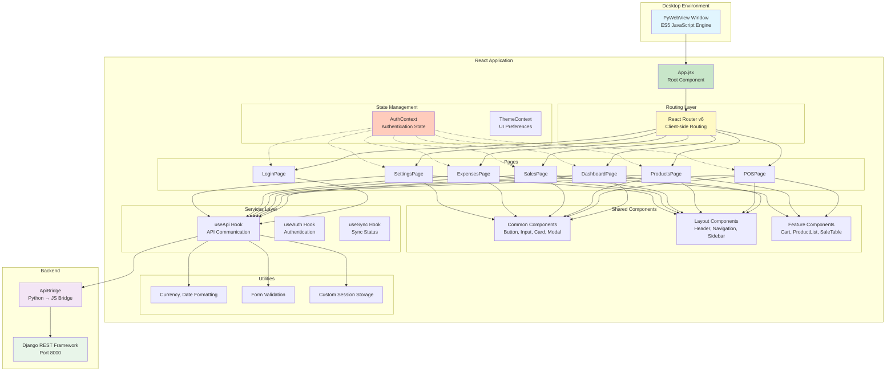
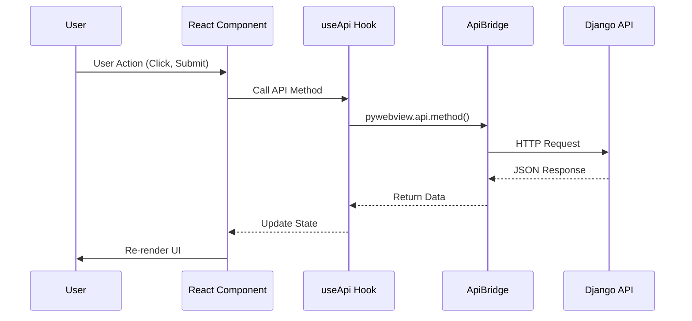
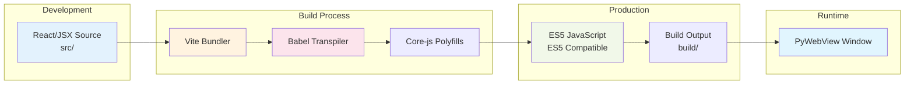
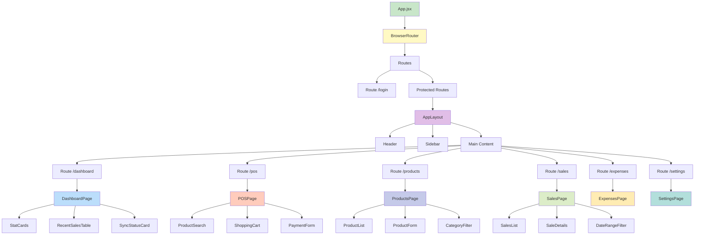
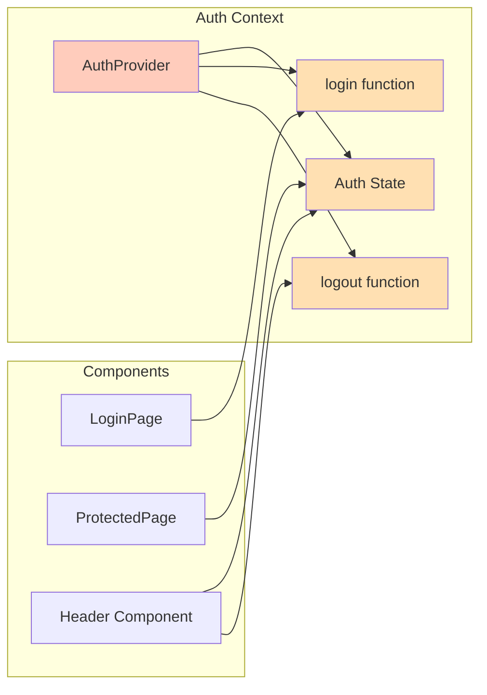
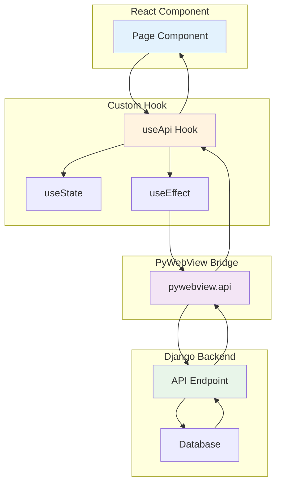

# React Architecture Diagram for SweetShopMa

## System Architecture Overview



## Data Flow Diagram



## Build Pipeline



## Component Hierarchy



## State Management Flow



## API Communication Pattern



## File Structure

```
sweetshopma-desktop/frontend/
│
├── src/
│   ├── App.jsx                    # Root component with routing
│   ├── index.js                   # Entry point
│   ├── index.html                 # HTML template
│   │
│   ├── components/
│   │   ├── common/                # Reusable UI components
│   │   │   ├── Button.jsx
│   │   │   ├── Input.jsx
│   │   │   ├── Select.jsx
│   │   │   ├── Card.jsx
│   │   │   ├── Modal.jsx
│   │   │   ├── Alert.jsx
│   │   │   ├── Table.jsx
│   │   │   ├── Badge.jsx
│   │   │   └── Spinner.jsx
│   │   │
│   │   ├── layout/                # Layout components
│   │   │   ├── AppLayout.jsx
│   │   │   ├── Header.jsx
│   │   │   ├── Sidebar.jsx
│   │   │   └── Navigation.jsx
│   │   │
│   │   └── features/              # Feature-specific components
│   │       ├── cart/
│   │       │   ├── Cart.jsx
│   │       │   ├── CartItem.jsx
│   │       │   └── CartSummary.jsx
│   │       ├── products/
│   │       │   ├── ProductList.jsx
│   │       │   ├── ProductCard.jsx
│   │       │   └── ProductForm.jsx
│   │       └── sales/
│   │           ├── SaleTable.jsx
│   │           ├── SaleRow.jsx
│   │           └── SaleFilters.jsx
│   │
│   ├── pages/                     # Page components
│   │   ├── LoginPage.jsx
│   │   ├── DashboardPage.jsx
│   │   ├── POSPage.jsx
│   │   ├── ProductsPage.jsx
│   │   ├── SalesPage.jsx
│   │   ├── ExpensesPage.jsx
│   │   └── SettingsPage.jsx
│   │
│   ├── hooks/                     # Custom React hooks
│   │   ├── useApi.js              # API communication
│   │   ├── useAuth.js             # Authentication
│   │   ├── useSync.js             # Sync status
│   │   └── useProducts.js         # Product data
│   │
│   ├── services/                  # Business logic
│   │   └── apiService.js          # API wrapper
│   │
│   ├── context/                   # React Context
│   │   ├── AuthContext.jsx        # Auth state
│   │   └── ThemeContext.jsx       # UI theme
│   │
│   ├── utils/                     # Helper functions
│   │   ├── formatters.js          # Currency, date
│   │   ├── validators.js          # Form validation
│   │   └── sessionStorage.js      # Session management
│   │
│   └── styles/                    # Styles
│       ├── global.css             # Global styles
│       ├── variables.css          # CSS variables
│       └── components/            # Component styles
│
├── public/                        # Static assets
│   ├── images/
│   └── fonts/
│
├── build/                         # Transpiled output (generated)
│   ├── assets/
│   └── index.html
│
├── templates/                     # Legacy templates (to remove)
│   ├── base.html
│   ├── login.html
│   ├── dashboard.html
│   └── ...
│
├── api.py                         # ApiBridge (keep)
├── main.py                        # PyWebView entry (modify)
├── utils.py                       # Template utils (remove later)
│
├── package.json                   # Node.js dependencies
├── vite.config.js                 # Vite configuration
├── babel.config.js                # Babel configuration
├── .eslintrc.js                   # ESLint configuration
└── README.md                      # Frontend documentation
```

## Key Design Decisions

### 1. **Why Babel Transpilation?**
- PyWebView only supports ES5 JavaScript
- Modern React requires ES6+ features
- Babel bridges this gap by transpiling to ES5

### 2. **Why Vite over Webpack?**
- Faster development server with HMR
- Simpler configuration
- Better build performance
- Native ES module support

### 3. **Why React Context over Redux?**
- Simpler for this application's needs
- Less boilerplate
- Built into React (no extra dependencies)
- Sufficient for auth and theme state

### 4. **Why Custom useApi Hook?**
- Wraps `pywebview.api` for consistent interface
- Centralizes error handling
- Manages loading states automatically
- Works with both paginated and direct array responses

### 5. **Why React Router v6?**
- Latest version with better performance
- Nested routes support
- Better TypeScript support (future-proofing)
- Simpler API than v5

---

**Document Version:** 1.0  
**Last Updated:** 2025-02-03
