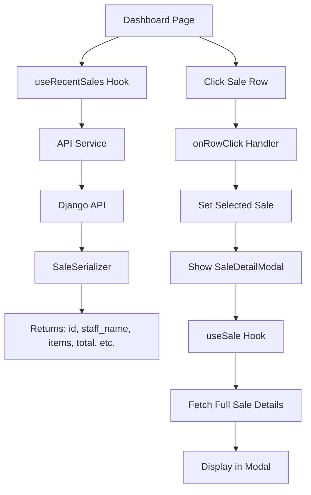

# Recent Sales Enhancement Plan

## Overview
Add cashier name and items summary to the Recent Sales table on the Dashboard, with click-to-view detailed order functionality.

## Current State Analysis

### Backend (Ready)
- [`Sale`](sweetshopma-desktop/backend/api/models.py:146) model has `staff` FK and `items` relation
- [`SaleSerializer`](sweetshopma-desktop/backend/api/serializers.py:153) already includes `staff_name` and `items`
- [`SaleViewSet.recent()`](sweetshopma-desktop/backend/api/views.py:285) returns full sale data

### Frontend (Needs Updates)
- [`DashboardPage.jsx`](sweetshopma-desktop/frontend/src/pages/DashboardPage.jsx:118) shows: ID, Time, Items, Total, Status
- Missing: cashier name column, items summary column
- No click handler on table rows

---

## Tasks

### 1. Create SaleDetailModal Component
**File:** `sweetshopma-desktop/frontend/src/components/common/SaleDetailModal.jsx`

Create a reusable modal component that displays:
- Sale header (ID, date, status, cashier, payment method)
- Totals breakdown (subtotal, tax, discount, total)
- Items table (product name, qty, unit price, line total)
- Notes section if present

### 2. Update DashboardPage.jsx
**File:** `sweetshopma-desktop/frontend/src/pages/DashboardPage.jsx`

Changes:
- Import `SaleDetailModal` and `useSale` hook
- Add state for `selectedSale` and `showDetailsModal`
- Add `onRowClick` handler to the Recent Sales table
- Update `salesColumns` to include:
  - `staff_name` (cashier name)
  - Items summary (truncated list or count with preview)

### 3. Update salesColumns Configuration
Add new columns:

```javascript
{
    header: 'Cashier',
    field: 'staff_name',
    width: '120px',
    render: (val) => val || '-'
},
{
    header: 'Items',
    field: 'items_summary',
    width: '200px',
    render: (val, row) => {
        // Show first 2-3 items with count
        const itemNames = row.items?.map(i => i.product_name) || [];
        const display = itemNames.slice(0, 2).join(', ');
        const more = itemNames.length > 2 ? ` +${itemNames.length - 2} more` : '';
        return itemNames.length > 0 ? `${display}${more}` : '-';
    }
},
{
    header: 'Actions',
    field: 'id',
    width: '100px',
    render: (val) => (
        <Button size="small" variant="secondary" onClick={(e) => {
            e.stopPropagation();
            handleViewDetails(val);
        }}>
            View
        </Button>
    ),
}]
```

### 4. Add View Details Handler
```javascript
const handleViewDetails = (saleId) => {
    const sale = recentSales.find(s => s.id === saleId);
    setSelectedSale(sale);
    setShowDetailsModal(true);
};
```

### 5. Test the Implementation
- Verify recent sales show cashier name
- Verify items summary displays correctly
- Verify clicking a row opens the detail modal
- Verify modal shows all sale details

---

## Files to Modify

| File | Changes |
|------|---------|
| `sweetshopma-desktop/frontend/src/components/common/SaleDetailModal.jsx` | NEW - Create reusable modal |
| `sweetshopma-desktop/frontend/src/pages/DashboardPage.jsx` | Add columns, click handler, modal |
| `sweetshopma-desktop/frontend/src/components/common/index.js` | Export SaleDetailModal |

---

## Implementation Order

1. ✅ Create SaleDetailModal component (reusable)
2. ✅ Export SaleDetailModal from components
3. ✅ Update DashboardPage with new columns (Cashier, Items, Actions)
4. ✅ Add View Details handler and modal state
5. ✅ Build completed successfully

---

## Mermaid Diagram: Data Flow



---

## Backend Already Supports
- ✅ `staff_name` - Cashier/cashier name from User model
- ✅ `items` - Full sale item details with product names
- ✅ `item_count` - Total number of items in sale
