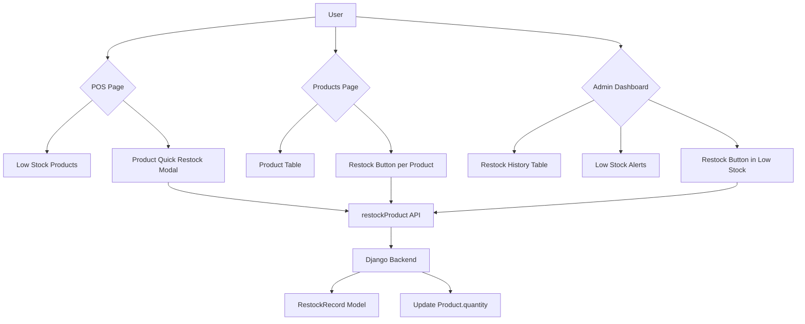

# Restock Feature Implementation Plan

## Overview
Implement a complete restock system for SweetShopMa that allows Admin and Moderator users to add stock to products from POS, Products Page, and Admin Dashboard.

## Architecture

## Backend Status: ✅ COMPLETE

The following are already implemented:
- [x] `RestockRecord` model with audit trail
- [x] `RestockViewSet` with `restock()` action
- [x] Permission check: `is_staff=True` required
- [x] `RestockSerializer` for validation
- [x] `RestockRecordSerializer` for responses
- [x] API endpoints registered in `urls.py`

---

## Frontend Implementation Todo List

### Phase 1: Restock Modal Component ✅ DONE
**File:** `sweetshopma-desktop/frontend/src/components/common/RestockModal.jsx`

- [x] Create `RestockModal` component
  - [x] Product info display (name, current stock, unit)
  - [x] Quantity input with validation (min: 0.01, max: 10000)
  - [x] Unit display
  - [x] Stock before/after preview
  - [x] Confirm/Cancel buttons
  - [x] Success/error feedback
  - [x] Auto-close on success with delay

- [x] Export from `sweetshopma-desktop/frontend/src/components/common/index.js`

### Phase 2: POS Page Integration ✅ DONE
**File:** `sweetshopma-desktop/frontend/src/pages/POSPage.jsx`

- [x] Add `RestockModal` import
- [x] Add restock state: `const [showRestockModal, setShowRestockModal] = useState(false)`
- [x] Add selected product for restock state
- [x] Add low stock indicator to product cards
  - [x] Visual badge for low stock items
  - [x] Restock button on low stock products
- [x] Implement `handleRestock(product)` function
- [x] Show modal when restock button clicked
- [x] Refetch products after successful restock

### Phase 3: Products Page Integration ✅ DONE
**File:** `sweetshopma-desktop/frontend/src/pages/ProductsPage.jsx`

- [x] Add `RestockModal` import
- [x] Add action column with restock button
- [x] Restock button visible only for staff users
- [x] Show stock status with low stock warning
- [x] Show toast notification on success (implicit via refetch)
- [x] Refetch products after successful restock

### Phase 4: Restock Records Page (Admin) ✅ DONE
**File:** `sweetshopma-desktop/frontend/src/pages/RestockRecordsPage.jsx`

- [x] Create new page for restock history
- [x] Add to routing in `App.jsx`
- [x] Implement `useRestockRecords()` hook
- [x] Create `RestockRecordsTable` component
  - [x] Date/time column
  - [x] Product name column
  - [x] Quantity added column
  - [x] Stock before/after columns
  - [x] User name column (who performed restock)
  - [x] Search functionality
  - [x] Stats cards (total records, total items added, unique staff)

### Phase 5: Low Stock Alerts Widget (Admin) ✅ DONE
**File:** `sweetshopma-desktop/frontend/src/pages/DashboardPage.jsx`

- [x] Add restock button to low stock products table
- [x] Show quick restock button for each item
- [x] Refetch low stock after successful restock

### Phase 6: Navigation Integration ✅ DONE
**File:** `sweetshopma-desktop/frontend/src/App.jsx`

- [x] Import RestockRecordsPage
- [x] Add route for `/restocks`

**File:** `sweetshopma-desktop/frontend/src/components/layout/Sidebar.jsx`

- [x] Add "Restock Records" menu item
- [x] Add ArrowUpCircle icon

---

## API Service Status: ✅ COMPLETE

The following methods are already implemented in `apiService.js`:
- [x] `getRestockRecords(productId)` - Get restock history
- [x] `restockProduct(productId, quantity)` - Perform restock operation

---

## Backend API Endpoints Status: ✅ COMPLETE

| Endpoint | Method | Action | Access |
|----------|--------|--------|--------|
| `/api/restocks/` | GET | List restock records | All authenticated |
| `/api/restocks/` | POST | Create record | Staff only |
| `/api/restocks/{id}/` | GET | Get single record | All authenticated |
| `/api/restocks/restock/` | POST | Restock product | Staff only |
| `/api/restocks/?product_id=x` | GET | Filter by product | All authenticated |

---

## Files Modified

| File | Changes |
|------|---------|
| `src/components/common/RestockModal.jsx` | New component - Restock dialog |
| `src/components/common/index.js` | Export RestockModal |
| `src/pages/POSPage.jsx` | Add restock functionality, low stock badges |
| `src/pages/ProductsPage.jsx` | Add restock action column, stock status |
| `src/pages/RestockRecordsPage.jsx` | New page - Restock history |
| `src/pages/DashboardPage.jsx` | Add restock to low stock alerts |
| `src/App.jsx` | Add RestockRecordsPage route |
| `src/components/layout/Sidebar.jsx` | Add Restock Records nav item |

---

## Testing Checklist

- [ ] Admin can restock products
- [ ] Moderator can restock products
- [ ] Regular user cannot restock (button hidden)
- [ ] Permission error shown for unauthorized access
- [ ] Product quantity updates correctly
- [ ] Restock record created with correct data
- [ ] Stock before/after calculated correctly
- [ ] Low stock badge appears on POS products
- [ ] Restock modal validates quantity input
- [ ] Restock history shows correct data

---

## Success Criteria

1. ✅ Admin and Moderator users can restock products from POS, Products page, and Admin dashboard
2. ✅ All restock operations are recorded in `RestockRecord` table
3. ✅ Regular users cannot access restock functionality (buttons hidden)
4. ✅ Low stock products are visually highlighted
5. ✅ Restock history is available for review

---

## Next Steps

1. **Build the frontend**: `cd sweetshopma-desktop/frontend && npm run build`
2. **Start the Django backend**: `cd sweetshopma-desktop/backend && python manage.py runserver`
3. **Test the PyWebView app**: `cd sweetshopma-desktop/frontend && python main.py`
4. **Verify restock functionality** works in all locations
