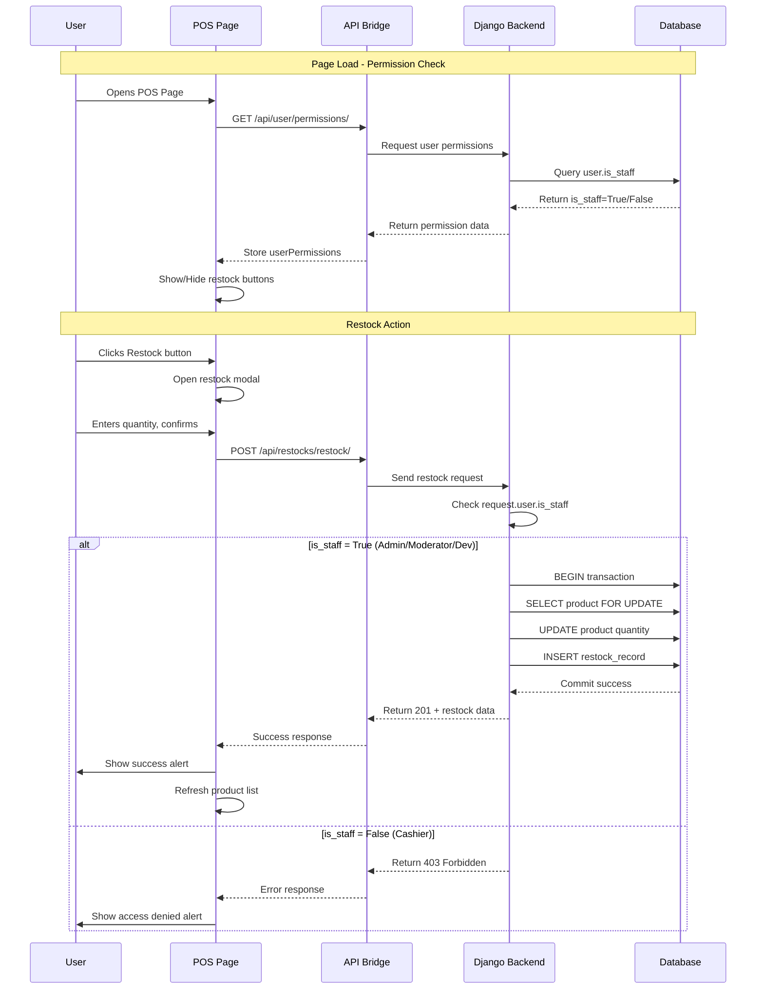
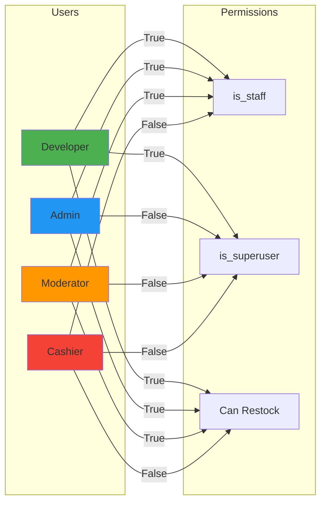
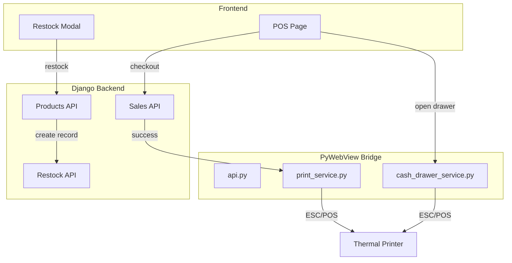

# Sale Features Implementation Plan
## Adding Receipt Printing, Cash Drawer Integration, and Restock Functionality

### Overview
This plan implements three missing features from the C# MAUI app into the Django desktop app:
1. **Receipt Printing** - Print receipts after successful sales
2. **Cash Drawer Integration** - Open cash drawer via ESC/POS commands
3. **Restock Functionality** - Track inventory restocking with audit trail (with permission checks)

### Permission System
The Django app uses the following permission model:
- **is_staff=True**: Users with elevated privileges (Admin, Moderator, Developer)
- **is_superuser=True**: Full system access (Developer only)
- **role field**: Stores role string ("Developer", "Admin", "Moderator", "User")

**Restock Permissions:**
- ✅ Developer (is_superuser=True)
- ✅ Admin (is_staff=True, role="Admin")
- ✅ Moderator (is_staff=True, role="Moderator")
- ❌ User/Cashier (is_staff=False, role="User")

### Permission Flow Diagram



### Role-Based Access Control Matrix



---

## Architecture Overview



---

## Feature 1: Receipt Printing

### Current State (C# MAUI)
- Uses HTML file + browser auto-print approach
- Creates temp HTML with receipt content
- Opens in default browser with `window.print()` trigger
- Cleans up temp file after 30 seconds

### Implementation Plan

#### Backend (Django)

**1. Create Sale Detail Endpoint** - `sweetshopma-desktop/backend/api/views.py`
```python
# Add to SaleViewSet
@action(detail=True, methods=['get'])
def receipt(self, request, pk=None):
    """Get sale details for receipt printing"""
    sale = self.get_object()
    items = sale.items.all()
    
    serializer = SaleItemSerializer(items, many=True)
    return Response({
        'sale': SaleSerializer(sale).data,
        'items': serializer.data
    })
```

#### Frontend (PyWebView)

**2. Create Print Service** - `sweetshopma-desktop/frontend/services/print_service.py`
```python
import os
import tempfile
import webbrowser
import threading
import time

class PrintService:
    """Handles receipt printing using HTML + browser approach"""
    
    def print_receipt(self, sale_data):
        """
        Print receipt by creating HTML file and opening in browser.
        
        Args:
            sale_data (dict): Sale data with items
        """
        # Generate HTML receipt
        html = self._generate_receipt_html(sale_data)
        
        # Create temp file
        temp_path = os.path.join(tempfile.gettempdir(), f'receipt_{sale_data["id"]}_{int(time.time())}.html')
        
        with open(temp_path, 'w', encoding='utf-8') as f:
            f.write(html)
        
        # Open in browser (triggers print dialog)
        webbrowser.open('file://' + temp_path)
        
        # Schedule cleanup
        threading.Thread(
            target=self._cleanup_file,
            args=(temp_path,),
            daemon=True
        ).start()
        
        return True
    
    def _generate_receipt_html(self, sale_data):
        """Generate HTML receipt with auto-print"""
        items_html = ""
        for item in sale_data['items']:
            items_html += f"""
            <div style="display: flex; justify-content: space-between; margin: 5px 0;">
                <span>{item['product_name']} x{item['quantity']}</span>
                <span>${item['subtotal']:.2f}</span>
            </div>
            """
        
        return f"""
<!DOCTYPE html>
<html>
<head>
    <meta charset="utf-8">
    <title>Receipt #{sale_data['id']}</title>
    <style>
        @media print {{
            @page {{ margin: 0.5in; size: 80mm auto; }}
            body {{ margin: 0; padding: 10px; }}
            .no-print {{ display: none; }}
        }}
        body {{
            font-family: 'Courier New', monospace;
            font-size: 12px;
            width: 80mm;
            margin: 0 auto;
        }}
        .header {{ text-align: center; border-bottom: 1px dashed #000; padding-bottom: 10px; }}
        .items {{ margin: 15px 0; }}
        .total {{ border-top: 1px dashed #000; padding-top: 10px; font-weight: bold; }}
        .footer {{ text-align: center; margin-top: 15px; font-size: 10px; }}
    </style>
</head>
<body>
    <div class="header">
        <h2>SWEET SHOP</h2>
        <p>Receipt #{sale_data['id']}</p>
        <p>{sale_data['created_at']}</p>
    </div>
    
    <div class="items">
        {items_html}
    </div>
    
    <div class="total">
        <div style="display: flex; justify-content: space-between;">
            <span>TOTAL</span>
            <span>${sale_data['total']:.2f}</span>
        </div>
    </div>
    
    <div class="footer">
        <p>Thank you for your purchase!</p>
        <p class="no-print">
            <button onclick="window.print()">Print Again</button>
            <button onclick="window.close()">Close</button>
        </p>
    </div>
    
    <script>
        window.onload = function() {{
            setTimeout(function() {{ window.print(); }}, 250);
        }};
    </script>
</body>
</html>
        """
    
    def _cleanup_file(self, path, delay=30):
        """Clean up temp file after delay"""
        time.sleep(delay)
        try:
            if os.path.exists(path):
                os.remove(path)
        except:
            pass
```

**3. Update API Bridge** - `sweetshopma-desktop/frontend/api.py`
```python
# Add method
def get_sale_receipt(self, sale_id):
    """Get sale details for receipt printing"""
    return self._get(f'sales/{sale_id}/receipt/')

def print_receipt(self, sale_id):
    """Print receipt for sale"""
    from services.print_service import PrintService
    
    result = self.get_sale_receipt(sale_id)
    if 'error' in result:
        return {'success': False, 'error': result['error']}
    
    printer = PrintService()
    printer.print_receipt(result)
    return {'success': True}
```

**4. Update POS Template** - `sweetshopma-desktop/frontend/templates/pos.html`
```javascript
// After successful checkout
if (result.id) {
    showAlert('Sale completed!', 'success');
    
    // Print receipt
    pywebview.api.print_receipt(result.id).then(function(printResult) {
        if (!printResult.success) {
            console.error('Print failed:', printResult.error);
        }
    });
    
    cart = [];
    updateCart();
    await loadProducts();
}
```

---

## Feature 2: Cash Drawer Integration

### Current State (C# MAUI)
- Sends ESC/POS command `0x1B 0x70 0x00 0x19 0xFA` to printer
- Tries COM/LPT port direct communication
- Falls back to Windows `copy` command to printer

### Implementation Plan

#### Frontend (PyWebView)

**1. Create Cash Drawer Service** - `sweetshopma-desktop/frontend/services/cash_drawer_service.py`
```python
import subprocess
import platform
import os

class CashDrawerService:
    """Opens cash drawer via ESC/POS commands to printer"""
    
    # ESC/POS command to open cash drawer
    # ESC p m t1 t2
    # ESC = 0x1B, p = 0x70, m = 0x00 (pin 0), t1 = 0x19 (25ms), t2 = 0xFA (250ms)
    DRAWER_COMMAND = bytes([0x1B, 0x70, 0x00, 0x19, 0xFA])
    
    def open_drawer(self):
        """
        Open cash drawer by sending ESC/POS command to printer.
        
        Returns:
            bool: True if command sent successfully
        """
        if platform.system() == 'Windows':
            return self._open_drawer_windows()
        else:
            return self._open_drawer_generic()
    
    def _open_drawer_windows(self):
        """Windows: Use copy command to send raw bytes to printer"""
        try:
            # Get default printer name
            result = subprocess.run(
                ['powershell', 
                 '-Command', 
                 'Get-WmiObject -Query "SELECT * FROM Win32_Printer WHERE Default=\\"TRUE\\"" | Select-Object -ExpandProperty Name'],
                capture_output=True,
                text=True,
                timeout=5
            )
            
            if result.returncode != 0 or not result.stdout.strip():
                return False
            
            printer_name = result.stdout.strip()
            
            # Create temp file with drawer command
            import tempfile
            temp_file = tempfile.NamedTemporaryFile(delete=False, suffix='.bin')
            temp_file.write(self.DRAWER_COMMAND)
            temp_file.close()
            
            try:
                # Send to printer using copy command
                subprocess.run(
                    ['cmd', '/c', 'copy', '/b', temp_file.name, f'"{printer_name}"'],
                    capture_output=True,
                    timeout=5,
                    creationflags=subprocess.CREATE_NO_WINDOW
                )
                return True
            finally:
                try:
                    os.unlink(temp_file.name)
                except:
                    pass
                    
        except Exception as e:
            print(f"Cash drawer error: {e}")
            return False
    
    def _open_drawer_generic(self):
        """Generic: Try lpr command (Linux/macOS)"""
        try:
            subprocess.run(
                ['lpr', '-P', 'default'],
                input=self.DRAWER_COMMAND,
                timeout=5
            )
            return True
        except:
            return False
```

**2. Update API Bridge** - `sweetshopma-desktop/frontend/api.py`
```python
def open_cash_drawer(self):
    """Open cash drawer"""
    from services.cash_drawer_service import CashDrawerService
    
    service = CashDrawerService()
    success = service.open_drawer()
    
    return {
        'success': success,
        'message': 'Cash drawer opened' if success else 'Failed to open cash drawer'
    }
```

**3. Update POS Template** - `sweetshopma-desktop/frontend/templates/pos.html`
```javascript
// Add cash drawer button
<button onclick="openCashDrawer()" class="btn-secondary">
    💰 Open Cash Drawer
</button>

<script>
async function openCashDrawer() {
    try {
        const result = await pywebview.api.open_cash_drawer();
        if (result.success) {
            showAlert('Cash drawer opened', 'success');
        } else {
            showAlert(result.message, 'error');
        }
    } catch (error) {
        showAlert('Failed to open cash drawer', 'error');
    }
}
</script>
```

---

## Feature 3: Restock Functionality

### Current State (C# MAUI)
- `RestockRecord` model tracks all restocking operations
- Stores: ProductId, QuantityAdded, StockBefore, StockAfter, UserId, UserName, Date
- Permission check: Only users with `CanRestock` permission
- Creates audit trail for inventory changes

### Implementation Plan

#### Backend (Django)

**1. Create RestockRecord Model** - `sweetshopma-desktop/backend/api/models.py`
```python
class RestockRecord(models.Model):
    """Audit trail for inventory restocking operations"""
    
    product = models.ForeignKey(
        Product,
        on_delete=models.CASCADE,
        related_name='restock_records'
    )
    
    # Denormalized fields for historical accuracy
    product_name = models.CharField(max_length=200)
    product_emoji = models.CharField(max_length=10, blank=True)
    
    # Restock details
    quantity_added = models.DecimalField(
        max_digits=10,
        decimal_places=3,
        validators=[MinValueValidator(Decimal('0.01'))]
    )
    stock_before = models.DecimalField(
        max_digits=10,
        decimal_places=3
    )
    stock_after = models.DecimalField(
        max_digits=10,
        decimal_places=3
    )
    
    # User tracking
    user = models.ForeignKey(
        User,
        on_delete=models.SET_NULL,
        null=True,
        related_name='restock_records'
    )
    user_name = models.CharField(max_length=100)
    
    # Timestamps
    restock_date = models.DateTimeField(auto_now_add=True)
    
    class Meta:
        db_table = 'api_restock_record'
        ordering = ['-restock_date']
        indexes = [
            models.Index(fields=['product']),
            models.Index(fields=['restock_date']),
            models.Index(fields=['user']),
        ]
    
    def __str__(self):
        return f"Restock {self.product_name}: +{self.quantity_added}"
```

**2. Create Migration**
```bash
cd sweetshopma-desktop/backend
python manage.py makemigrations
python manage.py migrate
```

**3. Create Restock Serializer** - `sweetshopma-desktop/backend/api/serializers.py`
```python
class RestockRecordSerializer(serializers.ModelSerializer):
    """Serializer for RestockRecord"""
    
    class Meta:
        model = RestockRecord
        fields = [
            'id',
            'product',
            'product_name',
            'product_emoji',
            'quantity_added',
            'stock_before',
            'stock_after',
            'user',
            'user_name',
            'restock_date'
        ]
        read_only_fields = ['user', 'user_name', 'restock_date']


class RestockSerializer(serializers.Serializer):
    """Serializer for restock action"""
    product_id = serializers.IntegerField()
    quantity = serializers.DecimalField(
        max_digits=10,
        decimal_places=3,
        min_value=Decimal('0.01')
    )
```

**4. Add Restock ViewSet** - `sweetshopma-desktop/backend/api/views.py`
```python
from rest_framework.decorators import action
from rest_framework.response import Response
from rest_framework import permissions
from django.db import transaction

class IsStaffOrReadOnly(permissions.BasePermission):
    """
    Custom permission: Only staff users (Admin, Moderator, Developer) can restock.
    """
    def has_permission(self, request, view):
        # Read permissions are allowed to any request
        if request.method in permissions.SAFE_METHODS:
            return True
        
        # Write permissions (restock) only allowed for staff users
        return request.user and request.user.is_staff

class RestockViewSet(viewsets.ModelViewSet):
    """ViewSet for RestockRecord with permission checks"""
    queryset = RestockRecord.objects.all()
    serializer_class = RestockRecordSerializer
    permission_classes = [IsStaffOrReadOnly]
    
    def get_queryset(self):
        """Filter by product if specified"""
        queryset = super().get_queryset()
        product_id = self.request.query_params.get('product_id')
        if product_id:
            queryset = queryset.filter(product_id=product_id)
        return queryset
    
    @action(detail=False, methods=['post'], permission_classes=[permissions.IsAuthenticated])
    def restock(self, request):
        """
        Restock a product and create audit record.
        
        Permission: Only staff users (is_staff=True) can restock.
        
        Request body:
        {
            "product_id": 1,
            "quantity": 10.5
        }
        """
        # Permission check: Only staff can restock
        if not request.user.is_staff:
            return Response(
                {'error': 'You do not have permission to restock products'},
                status=403
            )
        
        serializer = RestockSerializer(data=request.data)
        if not serializer.is_valid():
            return Response(serializer.errors, status=400)
        
        product_id = serializer.validated_data['product_id']
        quantity = serializer.validated_data['quantity']
        
        try:
            with transaction.atomic():
                # Get product and lock row
                product = Product.objects.select_for_update().get(id=product_id)
                
                # Record stock before
                stock_before = product.quantity
                
                # Update product quantity
                product.quantity += quantity
                product.save()
                
                # Create restock record
                restock_record = RestockRecord.objects.create(
                    product=product,
                    product_name=product.name,
                    product_emoji=getattr(product, 'emoji', ''),
                    quantity_added=quantity,
                    stock_before=stock_before,
                    stock_after=product.quantity,
                    user=request.user,
                    user_name=request.user.get_full_name() or request.user.username
                )
            
            # Serialize and return
            result_serializer = RestockRecordSerializer(restock_record)
            return Response(result_serializer.data, status=201)
            
        except Product.DoesNotExist:
            return Response({'error': 'Product not found'}, status=404)
        except Exception as e:
            return Response({'error': str(e)}, status=500)
```

**5. Update URLs** - `sweetshopma-desktop/backend/api/urls.py`
```python
# Register the ViewSets
router.register(r'restocks', RestockViewSet, basename='restock')
router.register(r'user', UserViewSet, basename='user')
```

#### Frontend (PyWebView)

**6. Update API Bridge** - `sweetshopma-desktop/frontend/api.py`
```python
# Restock API

def get_restock_records(self, product_id=None):
    """Get restock records"""
    params = {}
    if product_id:
        params['product_id'] = product_id
    return self._get('restocks/', params)

def restock_product(self, product_id, quantity):
    """Restock a product"""
    return self._post('restocks/restock/', {
        'product_id': product_id,
        'quantity': quantity
    })
```

**7. Create Restock Modal Component** - `sweetshopma-desktop/templates/components/restock_modal.html`
```html
<div id="restockModal" class="modal" style="display: none;">
    <div class="modal-content">
        <div class="modal-header">
            <h3>📦 Restock Product</h3>
            <button class="close-btn" onclick="closeRestockModal()">&times;</button>
        </div>
        <div class="modal-body">
            <div class="form-group">
                <label>Product</label>
                <input type="text" id="restockProductName" readonly>
            </div>
            <div class="form-group">
                <label>Current Stock</label>
                <input type="text" id="restockCurrentStock" readonly>
            </div>
            <div class="form-group">
                <label for="restockQuantity">Quantity to Add</label>
                <input type="number" id="restockQuantity" min="0.01" step="0.01" autofocus>
            </div>
            <div class="form-group">
                <small>New stock will be: <strong id="restockNewStock">-</strong></small>
            </div>
        </div>
        <div class="modal-footer">
            <button class="btn-secondary" onclick="closeRestockModal()">Cancel</button>
            <button class="btn-primary" onclick="confirmRestock()">Add Stock</button>
        </div>
    </div>
</div>

<script>
var currentRestockProduct = null;

function openRestockModal(product) {
    currentRestockProduct = product;
    document.getElementById('restockProductName').value = product.name;
    document.getElementById('restockCurrentStock').value = product.quantity + ' ' + product.unit;
    document.getElementById('restockQuantity').value = '';
    document.getElementById('restockNewStock').textContent = '-';
    document.getElementById('restockModal').style.display = 'block';
    document.getElementById('restockQuantity').focus();
}

function closeRestockModal() {
    document.getElementById('restockModal').style.display = 'none';
    currentRestockProduct = null;
}

function updateRestockPreview() {
    if (!currentRestockProduct) return;
    
    var quantity = parseFloat(document.getElementById('restockQuantity').value) || 0;
    var newStock = currentRestockProduct.quantity + quantity;
    document.getElementById('restockNewStock').textContent = newStock + ' ' + currentRestockProduct.unit;
}

async function confirmRestock() {
    if (!currentRestockProduct) return;
    
    var quantity = parseFloat(document.getElementById('restockQuantity').value);
    if (!quantity || quantity <= 0) {
        showAlert('Please enter a valid quantity', 'error');
        return;
    }
    
    try {
        showAlert('Processing restock...', 'info');
        
        var result = await apiCall('POST', 'restocks/restock/', {
            product_id: currentRestockProduct.id,
            quantity: quantity
        });
        
        if (result.id) {
            showAlert('Restocked successfully!', 'success');
            closeRestockModal();
            await loadProducts(); // Refresh product list
        } else {
            throw new Error(result.error || 'Restock failed');
        }
    } catch (error) {
        showAlert('Failed to restock: ' + error.message, 'error');
    }
}

// Update preview when quantity changes
document.addEventListener('DOMContentLoaded', function() {
    var quantityInput = document.getElementById('restockQuantity');
    if (quantityInput) {
        quantityInput.addEventListener('input', updateRestockPreview);
    }
});
</script>
```

**8. Add User Permissions API** - `sweetshopma-desktop/frontend/api.py`
```python
def get_user_permissions(self):
    """
    Get current user permissions.
    
    Returns:
        dict: User permissions including can_restock flag
    """
    try:
        # Get current user from session
        response = self._get('user/permissions/')
        return response
    except Exception as e:
        return {
            'error': str(e),
            'is_authenticated': False,
            'is_staff': False,
            'can_restock': False
        }
```

**9. Update Backend User Permissions Endpoint** - `sweetshopma-desktop/backend/api/views.py`
```python
from django.contrib.auth.models import User

class UserViewSet(viewsets.ViewSet):
    """ViewSet for user-related operations"""
    
    @action(detail=False, methods=['get'])
    def permissions(self, request):
        """
        Get current user permissions.
        
        Returns:
            dict with is_authenticated, is_staff, can_restock, role
        """
        if not request.user.is_authenticated:
            return Response({
                'is_authenticated': False,
                'is_staff': False,
                'can_restock': False,
                'role': None
            })
        
        return Response({
            'is_authenticated': True,
            'is_staff': request.user.is_staff,
            'is_superuser': request.user.is_superuser,
            'can_restock': request.user.is_staff,
            'role': getattr(request.user, 'role', None),
            'username': request.user.username,
            'full_name': request.user.get_full_name()
        })
```

**10. Add Restock Button to POS Page** - `sweetshopma-desktop/templates/pos.html`
```html
<!-- In product card -->
<div class="product-card">
    <div class="product-emoji">{{ product.emoji }}</div>
    <div class="product-name">{{ product.name }}</div>
    <div class="product-price">${{ product.price }}</div>
    <div class="product-stock">{{ product.quantity }} {{ product.unit }}</div>
    <!-- Restock button - only visible if user has permission -->
    <button class="btn-restock" id="restock-btn-{{ product.id }}"
            onclick='openRestockModal({{ product|tojson }})' style="display: none;">
        📦 Restock
    </button>
    <button class="btn-add" onclick='addToCart({{ product|tojson }})'>
        Add to Cart
    </button>
</div>

<!-- Include modal -->


<script>
// Global variable to track user permissions
var userPermissions = {
    is_authenticated: false,
    is_staff: false,
    can_restock: false
};

// Load user permissions on page load
async function loadUserPermissions() {
    try {
        var result = await apiCall('GET', 'user/permissions/');
        if (!result.error) {
            userPermissions = result;
            updateRestockButtonsVisibility();
        }
    } catch (error) {
        console.error('Failed to load user permissions:', error);
    }
}

// Show/hide restock buttons based on permissions
function updateRestockButtonsVisibility() {
    var restockButtons = document.querySelectorAll('[id^="restock-btn-"]');
    for (var i = 0; i < restockButtons.length; i++) {
        if (userPermissions.can_restock) {
            restockButtons[i].style.display = 'inline-block';
        } else {
            restockButtons[i].style.display = 'none';
        }
    }
}

// Call on page load
document.addEventListener('DOMContentLoaded', function() {
    loadUserPermissions();
});
</script>
```

---

## CSS Styles

Add to `sweetshopma-desktop/frontend/static/css/style.css`:

```css
/* Modal Styles */
.modal {
    position: fixed;
    top: 0;
    left: 0;
    width: 100%;
    height: 100%;
    background: rgba(0, 0, 0, 0.5);
    display: flex;
    align-items: center;
    justify-content: center;
    z-index: 1000;
}

.modal-content {
    background: white;
    border-radius: 8px;
    width: 90%;
    max-width: 400px;
    box-shadow: 0 4px 20px rgba(0, 0, 0, 0.3);
}

.modal-header {
    display: flex;
    justify-content: space-between;
    align-items: center;
    padding: 15px 20px;
    border-bottom: 1px solid #e0e0e0;
}

.modal-header h3 {
    margin: 0;
    font-size: 18px;
}

.close-btn {
    background: none;
    border: none;
    font-size: 24px;
    cursor: pointer;
    padding: 0;
    width: 30px;
    height: 30px;
}

.modal-body {
    padding: 20px;
}

.modal-footer {
    display: flex;
    justify-content: flex-end;
    gap: 10px;
    padding: 15px 20px;
    border-top: 1px solid #e0e0e0;
}

/* Restock Button */
.btn-restock {
    background: #ff9800;
    color: white;
    border: none;
    padding: 5px 10px;
    border-radius: 4px;
    cursor: pointer;
    font-size: 12px;
    margin-top: 5px;
}

.btn-restock:hover {
    background: #f57c00;
}
```

---

## Implementation Order

### Phase 1: Backend Setup
1. Create `RestockRecord` model
2. Create migration
3. Add `RestockSerializer` and `RestockViewSet` with permission checks
4. Add `UserViewSet` with permissions endpoint
5. Update URLs
6. Add receipt endpoint to `SaleViewSet`

### Phase 2: Frontend Services
1. Create `print_service.py`
2. Create `cash_drawer_service.py`
3. Update `api.py` with new methods (including `get_user_permissions`)

### Phase 3: Frontend UI
1. Create `restock_modal.html` component
2. Update `pos.html` with:
   - Restock buttons (hidden by default, shown based on permissions)
   - User permission loading
   - Receipt printing call after checkout
   - Cash drawer button

### Phase 4: Testing
1. Test restock functionality with different user roles
2. Test permission checks (Admin/Moderator can restock, User cannot)
3. Test receipt printing
4. Test cash drawer integration
5. Verify data integrity

---

## Testing Checklist

### Permission Testing
- [ ] Admin user can see and use restock buttons
- [ ] Moderator user can see and use restock buttons
- [ ] Regular user cannot see restock buttons
- [ ] API returns 403 for non-staff users attempting restock
- [ ] User permissions endpoint returns correct data

### Restock Testing
- [ ] Restock creates proper audit record
- [ ] Restock updates product quantity correctly
- [ ] Restock modal shows correct preview
- [ ] Restock record stores user information correctly

### Receipt Printing
- [ ] Receipt prints after successful sale
- [ ] Receipt shows all sale details correctly
- [ ] Receipt HTML is properly formatted
- [ ] Temp file is cleaned up after printing

### Cash Drawer
- [ ] Cash drawer opens when button clicked
- [ ] Cash drawer button works on Windows
- [ ] Error handling works for all features

---

## Error Handling

### Receipt Printing Error Handling

**Frontend (print_service.py)**
```python
class PrintService:
    def print_receipt(self, sale_data):
        """Print receipt with comprehensive error handling"""
        try:
            # Validate sale data
            if not sale_data or 'id' not in sale_data:
                return {'success': False, 'error': 'Invalid sale data'}
            
            # Generate HTML
            html = self._generate_receipt_html(sale_data)
            
            # Create temp file
            try:
                temp_path = os.path.join(tempfile.gettempdir(),
                                        f'receipt_{sale_data["id"]}_{int(time.time())}.html')
                with open(temp_path, 'w', encoding='utf-8') as f:
                    f.write(html)
            except IOError as e:
                return {'success': False, 'error': f'Failed to create receipt file: {str(e)}'}
            
            # Open in browser
            try:
                webbrowser.open('file://' + temp_path)
            except Exception as e:
                return {'success': False, 'error': f'Failed to open browser: {str(e)}'}
            
            # Schedule cleanup
            threading.Thread(
                target=self._cleanup_file,
                args=(temp_path,),
                daemon=True
            ).start()
            
            return {'success': True}
            
        except Exception as e:
            return {'success': False, 'error': f'Unexpected error: {str(e)}'}
```

**Common Errors & Solutions:**
| Error | Cause | Solution |
|-------|-------|----------|
| `Invalid sale data` | Missing sale ID or empty data | Check API response before printing |
| `Failed to create receipt file` | Temp directory not writable | Check file permissions |
| `Failed to open browser` | No default browser configured | Set default browser in OS |
| `Temp file not cleaned up` | File still in use | Extend cleanup delay or ignore |

---

### Cash Drawer Error Handling

**Frontend (cash_drawer_service.py)**
```python
class CashDrawerService:
    def open_drawer(self):
        """Open cash drawer with comprehensive error handling"""
        try:
            # Check platform support
            if platform.system() not in ['Windows', 'Linux', 'Darwin']:
                return {'success': False, 'error': 'Unsupported platform'}
            
            if platform.system() == 'Windows':
                result = self._open_drawer_windows()
            else:
                result = self._open_drawer_generic()
            
            if result:
                return {'success': True}
            else:
                return {'success': False, 'error': 'Failed to send drawer command'}
                
        except subprocess.TimeoutExpired:
            return {'success': False, 'error': 'Printer communication timeout'}
        except PermissionError:
            return {'success': False, 'error': 'Permission denied - check printer access'}
        except Exception as e:
            return {'success': False, 'error': f'Unexpected error: {str(e)}'}
    
    def _open_drawer_windows(self):
        """Windows-specific error handling"""
        try:
            # Get default printer
            result = subprocess.run(
                ['powershell', '-Command',
                 'Get-WmiObject -Query "SELECT * FROM Win32_Printer WHERE Default=\\"TRUE\\"" | Select-Object -ExpandProperty Name'],
                capture_output=True,
                text=True,
                timeout=5
            )
            
            if result.returncode != 0:
                raise Exception(f'PowerShell error: {result.stderr}')
            
            if not result.stdout.strip():
                return {'success': False, 'error': 'No default printer configured'}
            
            printer_name = result.stdout.strip()
            
            # Create and send command file
            import tempfile
            temp_file = tempfile.NamedTemporaryFile(delete=False, suffix='.bin')
            temp_file.write(self.DRAWER_COMMAND)
            temp_file.close()
            
            try:
                subprocess.run(
                    ['cmd', '/c', 'copy', '/b', temp_file.name, f'"{printer_name}"'],
                    capture_output=True,
                    timeout=5,
                    creationflags=subprocess.CREATE_NO_WINDOW,
                    check=True
                )
                return True
            except subprocess.CalledProcessError as e:
                raise Exception(f'Copy command failed: {e.stderr}')
            finally:
                try:
                    os.unlink(temp_file.name)
                except:
                    pass
                    
        except subprocess.TimeoutExpired:
            raise Exception('PowerShell command timed out')
        except Exception as e:
            raise Exception(str(e))
```

**Common Errors & Solutions:**
| Error | Cause | Solution |
|-------|-------|----------|
| `No default printer configured` | No printer set as default | Set default printer in Windows settings |
| `PowerShell command timed out` | PowerShell not responding | Check PowerShell installation |
| `Copy command failed` | Printer offline or disconnected | Check printer connection and status |
| `Permission denied` | Insufficient privileges | Run application as administrator |
| `Unsupported platform` | Running on unsupported OS | Use Windows or add platform support |

---

### Restock Error Handling

**Backend (views.py)**
```python
@action(detail=False, methods=['post'], permission_classes=[permissions.IsAuthenticated])
def restock(self, request):
    """Restock with comprehensive error handling"""
    # Permission check
    if not request.user.is_staff:
        return Response(
            {'error': 'You do not have permission to restock products', 'code': 'PERMISSION_DENIED'},
            status=403
        )
    
    # Validate input
    serializer = RestockSerializer(data=request.data)
    if not serializer.is_valid():
        return Response({
            'error': 'Invalid input data',
            'details': serializer.errors,
            'code': 'VALIDATION_ERROR'
        }, status=400)
    
    product_id = serializer.validated_data['product_id']
    quantity = serializer.validated_data['quantity']
    
    try:
        with transaction.atomic():
            # Get product with row lock
            product = Product.objects.select_for_update().get(id=product_id)
            
            # Business rule: Max restock quantity
            if quantity > 10000:
                return Response({
                    'error': 'Quantity exceeds maximum limit',
                    'code': 'QUANTITY_EXCEEDED',
                    'max_allowed': 10000
                }, status=400)
            
            # Business rule: Check for negative stock after restock
            if product.quantity + quantity < 0:
                return Response({
                    'error': 'Resulting stock cannot be negative',
                    'code': 'INVALID_QUANTITY',
                    'current_stock': float(product.quantity)
                }, status=400)
            
            # Record stock before
            stock_before = product.quantity
            
            # Update product quantity
            product.quantity += quantity
            product.full_clean()  # Validate model constraints
            product.save()
            
            # Create restock record
            restock_record = RestockRecord.objects.create(
                product=product,
                product_name=product.name,
                product_emoji=getattr(product, 'emoji', ''),
                quantity_added=quantity,
                stock_before=stock_before,
                stock_after=product.quantity,
                user=request.user,
                user_name=request.user.get_full_name() or request.user.username
            )
        
        # Serialize and return
        result_serializer = RestockRecordSerializer(restock_record)
        return Response(result_serializer.data, status=201)
        
    except Product.DoesNotExist:
        return Response({
            'error': 'Product not found',
            'code': 'PRODUCT_NOT_FOUND',
            'product_id': product_id
        }, status=404)
        
    except ValidationError as e:
        return Response({
            'error': 'Data validation failed',
            'details': e.message_dict,
            'code': 'VALIDATION_ERROR'
        }, status=400)
        
    except Exception as e:
        return Response({
            'error': 'Internal server error',
            'code': 'INTERNAL_ERROR',
            'detail': str(e) if settings.DEBUG else 'An error occurred'
        }, status=500)
```

**Frontend (pos.html)**
```javascript
async function confirmRestock() {
    if (!currentRestockProduct) return;
    
    var quantity = parseFloat(document.getElementById('restockQuantity').value);
    
    // Client-side validation
    if (!quantity || quantity <= 0) {
        showAlert('Please enter a valid quantity', 'error');
        return;
    }
    
    if (quantity > 10000) {
        showAlert('Quantity cannot exceed 10,000', 'error');
        return;
    }
    
    try {
        showAlert('Processing restock...', 'info');
        
        var result = await apiCall('POST', 'restocks/restock/', {
            product_id: currentRestockProduct.id,
            quantity: quantity
        });
        
        if (result.error) {
            // Handle specific error codes
            if (result.code === 'PERMISSION_DENIED') {
                showAlert('Access denied: You do not have permission to restock', 'error');
            } else if (result.code === 'PRODUCT_NOT_FOUND') {
                showAlert('Product not found - it may have been deleted', 'error');
            } else if (result.code === 'QUANTITY_EXCEEDED') {
                showAlert('Quantity exceeds maximum limit', 'error');
            } else {
                showAlert('Restock failed: ' + result.error, 'error');
            }
            return;
        }
        
        if (result.id) {
            showAlert('Restocked successfully!', 'success');
            closeRestockModal();
            await loadProducts();
        } else {
            throw new Error('Invalid response from server');
        }
    } catch (error) {
        showAlert('Failed to restock: ' + error.message, 'error');
    }
}
```

**Common Errors & Solutions:**
| Error Code | Cause | Solution |
|------------|-------|----------|
| `PERMISSION_DENIED` | User is not staff | Login as Admin/Moderator |
| `PRODUCT_NOT_FOUND` | Product deleted or invalid ID | Refresh product list |
| `VALIDATION_ERROR` | Invalid input data | Check quantity format |
| `QUANTITY_EXCEEDED` | Quantity > 10,000 | Enter smaller quantity |
| `INVALID_QUANTITY` | Would result in negative stock | Check current stock level |
| `INTERNAL_ERROR` | Database or server error | Check server logs |

---

## Notes

### Receipt Printing
- Uses browser's print dialog (universal compatibility)
- Works with any printer configured in OS
- Auto-triggers print dialog after 250ms delay
- Temp file cleaned up after 30 seconds
- Handles file permission and browser availability errors

### Cash Drawer
- ESC/POS command is standard for thermal printers
- Requires printer with cash drawer port
- Windows: Uses `copy` command to send raw bytes
- Linux/macOS: Uses `lpr` command
- Handles printer offline and timeout errors

### Restock
- Creates complete audit trail
- Stores product name/emoji for historical accuracy
- Transaction ensures data integrity
- Permission-based access control
- Comprehensive validation and error handling
- Business rule validation (max quantity, stock limits)

---

## Logging and Monitoring

### Backend Logging (Django)

**Configure Logging in settings.py**
```python
LOGGING = {
    'version': 1,
    'disable_existing_loggers': False,
    'formatters': {
        'verbose': {
            'format': '{levelname} {asctime} {module} {process:d} {thread:d} {message}',
            'style': '{',
        },
        'simple': {
            'format': '{levelname} {asctime} {module} {message}',
            'style': '{',
        },
    },
    'handlers': {
        'file': {
            'level': 'INFO',
            'class': 'logging.FileHandler',
            'filename': 'logs/sweetshop.log',
            'formatter': 'verbose',
        },
        'console': {
            'level': 'DEBUG',
            'class': 'logging.StreamHandler',
            'formatter': 'simple',
        },
    },
    'loggers': {
        'django': {
            'handlers': ['file', 'console'],
            'level': 'INFO',
            'propagate': False,
        },
        'api': {
            'handlers': ['file', 'console'],
            'level': 'DEBUG',
            'propagate': False,
        },
    },
}
```

**Logging in RestockViewSet**
```python
import logging

logger = logging.getLogger(__name__)

@action(detail=False, methods=['post'], permission_classes=[permissions.IsAuthenticated])
def restock(self, request):
    """Restock with logging"""
    user = request.user
    
    # Log attempt
    logger.info(f'Restock attempt by user {user.username} (is_staff={user.is_staff})')
    
    # Permission check
    if not request.user.is_staff:
        logger.warning(f'Permission denied: User {user.username} attempted to restock without staff privileges')
        return Response(
            {'error': 'You do not have permission to restock products', 'code': 'PERMISSION_DENIED'},
            status=403
        )
    
    # Validate input
    serializer = RestockSerializer(data=request.data)
    if not serializer.is_valid():
        logger.warning(f'Validation failed for restock by user {user.username}: {serializer.errors}')
        return Response({
            'error': 'Invalid input data',
            'details': serializer.errors,
            'code': 'VALIDATION_ERROR'
        }, status=400)
    
    product_id = serializer.validated_data['product_id']
    quantity = serializer.validated_data['quantity']
    
    try:
        with transaction.atomic():
            product = Product.objects.select_for_update().get(id=product_id)
            stock_before = product.quantity
            
            logger.info(f'Processing restock: Product {product.name} (ID={product_id}), Quantity={quantity}, Stock Before={stock_before}')
            
            # Business rule checks
            if quantity > 10000:
                logger.warning(f'Quantity exceeded: User {user.username} attempted to restock {quantity} units (max=10000)')
                return Response({
                    'error': 'Quantity exceeds maximum limit',
                    'code': 'QUANTITY_EXCEEDED',
                    'max_allowed': 10000
                }, status=400)
            
            product.quantity += quantity
            product.full_clean()
            product.save()
            
            restock_record = RestockRecord.objects.create(
                product=product,
                product_name=product.name,
                product_emoji=getattr(product, 'emoji', ''),
                quantity_added=quantity,
                stock_before=stock_before,
                stock_after=product.quantity,
                user=request.user,
                user_name=request.user.get_full_name() or request.user.username
            )
        
        logger.info(f'Restock successful: Record ID={restock_record.id}, Product={product.name}, New Stock={product.quantity}')
        
        result_serializer = RestockRecordSerializer(restock_record)
        return Response(result_serializer.data, status=201)
        
    except Product.DoesNotExist:
        logger.error(f'Product not found: ID={product_id} requested by user {user.username}')
        return Response({
            'error': 'Product not found',
            'code': 'PRODUCT_NOT_FOUND',
            'product_id': product_id
        }, status=404)
        
    except Exception as e:
        logger.exception(f'Unexpected error during restock by user {user.username}: {str(e)}')
        return Response({
            'error': 'Internal server error',
            'code': 'INTERNAL_ERROR',
            'detail': str(e) if settings.DEBUG else 'An error occurred'
        }, status=500)
```

**Logging in SaleViewSet (Receipt)**
```python
@action(detail=True, methods=['get'])
def receipt(self, request, pk=None):
    """Get sale details for receipt printing with logging"""
    logger.info(f'Receipt requested for sale ID={pk} by user {request.user.username}')
    
    try:
        sale = self.get_object()
        items = sale.items.all()
        
        logger.debug(f'Generating receipt for sale {pk}: {items.count()} items, total={sale.total}')
        
        serializer = SaleItemSerializer(items, many=True)
        return Response({
            'sale': SaleSerializer(sale).data,
            'items': serializer.data
        })
        
    except Sale.DoesNotExist:
        logger.error(f'Sale not found for receipt: ID={pk}')
        return Response({'error': 'Sale not found'}, status=404)
```

### Frontend Logging (PyWebView)

**Configure Logging in main.py**
```python
import logging
import os
from datetime import datetime

# Configure logging
log_dir = os.path.join(os.path.dirname(__file__), 'logs')
os.makedirs(log_dir, exist_ok=True)

log_file = os.path.join(log_dir, f'sweetshop_{datetime.now().strftime("%Y%m%d")}.log')

logging.basicConfig(
    level=logging.DEBUG,
    format='%(asctime)s - %(name)s - %(levelname)s - %(message)s',
    handlers=[
        logging.FileHandler(log_file),
        logging.StreamHandler()
    ]
)

logger = logging.getLogger(__name__)
logger.info('Application started')
```

**Logging in PrintService**
```python
import logging

logger = logging.getLogger(__name__)

class PrintService:
    def print_receipt(self, sale_data):
        """Print receipt with logging"""
        logger.info(f'Print receipt requested for sale ID={sale_data.get("id")}')
        
        try:
            if not sale_data or 'id' not in sale_data:
                logger.error(f'Invalid sale data for printing: {sale_data}')
                return {'success': False, 'error': 'Invalid sale data'}
            
            html = self._generate_receipt_html(sale_data)
            temp_path = os.path.join(tempfile.gettempdir(),
                                    f'receipt_{sale_data["id"]}_{int(time.time())}.html')
            
            logger.debug(f'Creating receipt file: {temp_path}')
            
            with open(temp_path, 'w', encoding='utf-8') as f:
                f.write(html)
            
            webbrowser.open('file://' + temp_path)
            logger.info(f'Receipt sent to browser: Sale ID={sale_data["id"]}, File={temp_path}')
            
            threading.Thread(
                target=self._cleanup_file,
                args=(temp_path,),
                daemon=True
            ).start()
            
            return {'success': True}
            
        except Exception as e:
            logger.exception(f'Failed to print receipt for sale {sale_data.get("id")}: {str(e)}')
            return {'success': False, 'error': f'Unexpected error: {str(e)}'}
```

**Logging in CashDrawerService**
```python
import logging

logger = logging.getLogger(__name__)

class CashDrawerService:
    def open_drawer(self):
        """Open cash drawer with logging"""
        logger.info('Cash drawer open requested')
        
        try:
            if platform.system() not in ['Windows', 'Linux', 'Darwin']:
                logger.warning(f'Unsupported platform for cash drawer: {platform.system()}')
                return {'success': False, 'error': 'Unsupported platform'}
            
            if platform.system() == 'Windows':
                result = self._open_drawer_windows()
            else:
                result = self._open_drawer_generic()
            
            if result:
                logger.info('Cash drawer opened successfully')
                return {'success': True}
            else:
                logger.warning('Failed to open cash drawer: Command returned false')
                return {'success': False, 'error': 'Failed to send drawer command'}
                
        except subprocess.TimeoutExpired:
            logger.error('Cash drawer timeout: Printer communication timed out')
            return {'success': False, 'error': 'Printer communication timeout'}
        except PermissionError:
            logger.error('Cash drawer permission denied: Insufficient privileges')
            return {'success': False, 'error': 'Permission denied - check printer access'}
        except Exception as e:
            logger.exception(f'Unexpected error opening cash drawer: {str(e)}')
            return {'success': False, 'error': f'Unexpected error: {str(e)}'}
```

### Monitoring and Alerts

**Key Metrics to Monitor**

| Metric | Description | Alert Threshold |
|--------|-------------|-----------------|
| Restock failures | Number of failed restock attempts | > 10/hour |
| Permission denials | Staff-only access violations | > 5/hour |
| Print failures | Failed receipt prints | > 20/hour |
| Cash drawer failures | Failed drawer opens | > 10/hour |
| API response time | Average API response time | > 500ms |
| Database locks | Locked transactions | > 5 concurrent |

**Log Analysis Queries**

```bash
# Count restock operations by user
grep "Restock successful" logs/sweetshop.log | awk '{print $NF}' | sort | uniq -c

# Find permission denials
grep "Permission denied" logs/sweetshop.log

# Find print failures
grep "Failed to print receipt" logs/sweetshop.log

# Find cash drawer errors
grep "Cash drawer" logs/sweetshop.log | grep -i "error\|fail\|timeout"

# Recent errors (last 100 lines)
tail -100 logs/sweetshop.log | grep "ERROR"

# Statistics by hour
grep "$(date +%Y-%m-%d)" logs/sweetshop.log | awk '{print $2}' | cut -d: -f1 | sort | uniq -c
```

### Security Logging

**Audit Trail for Sensitive Actions**

```python
# Log all sensitive operations
logger.info(f'AUDIT: User {user.username} performed {action} on {object_type} {object_id}')

# Examples:
# AUDIT: User admin performed RESTOCK on Product 123
# AUDIT: User sara performed SALE on Sale 456
# AUDIT: User mohamed performed REFUND on Sale 789
```
