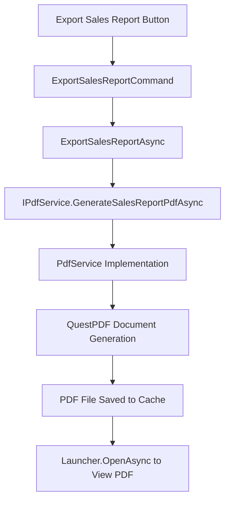

# Sales Report Export Implementation Plan

## Problem Statement

The "Export Sales Report" button in the admin dashboard is not working. The button is defined in XAML and the command is wired up in `AdminViewModel`, but the `ExportSalesReportAsync()` method is a stub that only shows a status message saying "Sales report export will be implemented soon".

## Current State Analysis

### Existing Components

1. **XAML Button** (AdminDashboardPage.xaml):
   ```xml
   <Button Text="Export Sales Report" 
           BackgroundColor="#4CAF50" 
           TextColor="White" 
           Command="{Binding ExportSalesReportCommand}"/>
   ```

2. **Command Definition** (AdminViewModel.cs:215):
   ```csharp
   ExportSalesReportCommand = new Command(async () => await ExportSalesReportAsync(), () => !IsBusy);
   ```

3. **Stub Implementation** (AdminViewModel.cs:2575-2587):
   ```csharp
   private async Task ExportSalesReportAsync()
   {
       IsBusy = true;
       try
       {
           ShowStatus("Sales report export will be implemented soon", false);
           // TODO: Implement sales report export
       }
       finally
       {
           IsBusy = false;
       }
   }
   ```

4. **PDF Generation Infrastructure**:
   - `IPdfService` interface with existing methods for payroll reports
   - `PdfService` implementation using QuestPDF library
   - Pattern established for RTL/Arabic support and currency formatting (EGP)

### Available Sales Data

From `AdminViewModel`, the following sales metrics are available:
- `TotalSales` - Total revenue from all orders
- `TotalOrders` - Number of completed orders
- `AverageOrderValue` - Average order value
- `TotalItemsSold` - Total quantity of items sold
- `Last7DaysSales` - Sales in the last 7 days
- `TopProducts` - ObservableCollection of top 5 products by sales
- `RecentOrders` - Recent order history

## Solution Architecture

### Component Overview



### Implementation Steps

#### Step 1: Add Method to IPdfService Interface

Add a new method signature to `SweetShopMa/Services/IPdfService.cs`:

```csharp
Task<string?> GenerateSalesReportPdfAsync(
    decimal totalSales,
    int totalOrders,
    decimal averageOrderValue,
    decimal totalItemsSold,
    decimal last7DaysSales,
    List<ProductReportItem> topProducts,
    List<Order> recentOrders);
```

#### Step 2: Implement PDF Generation in PdfService

Implement the method in `SweetShopMa/Services/PdfService.cs` following the existing pattern:
- Use QuestPDF for document generation
- Support RTL (Arabic) and LTR (English) layouts
- Format currency as EGP (ج.م.)
- Include sales metrics summary section
- Include top products table
- Include recent orders table
- Add footer with generation timestamp

PDF Structure:
```
┌─────────────────────────────────────┐
│      Sales Report - [Date]          │
├─────────────────────────────────────┤
│  Summary Metrics:                    │
│  • Total Sales: EGP X,XXX.XX        │
│  • Total Orders: XXX                 │
│  • Average Order Value: EGP XXX.XX   │
│  • Total Items Sold: XXX             │
│  • Last 7 Days Sales: EGP X,XXX.XX  │
├─────────────────────────────────────┤
│  Top Products:                       │
│  ┌─────────────────────────────────┐ │
│  │ Name | Qty | Unit | Total       │ │
│  │ [Product 1] | 10 | PCS | EGP 50  │ │
│  │ [Product 2] | 5 | KGS | EGP 75   │ │
│  └─────────────────────────────────┘ │
├─────────────────────────────────────┤
│  Recent Orders:                      │
│  ┌─────────────────────────────────┐ │
│  │ Date | Cashier | Items | Total   │ │
│  │ 2024-01-15 | John | 5 | EGP 25   │ │
│  └─────────────────────────────────┘ │
├─────────────────────────────────────┤
│  Generated on: [Timestamp]           │
└─────────────────────────────────────┘
```

#### Step 3: Update ExportSalesReportAsync in AdminViewModel

Replace the stub implementation with actual PDF generation:

```csharp
private async Task ExportSalesReportAsync()
{
    IsBusy = true;
    try
    {
        ShowStatus("Generating sales report...", false);

        var topProductsList = TopProducts.ToList();
        var recentOrdersList = RecentOrders.ToList();

        var filePath = await _pdfService.GenerateSalesReportPdfAsync(
            TotalSales,
            TotalOrders,
            AverageOrderValue,
            TotalItemsSold,
            Last7DaysSales,
            topProductsList,
            recentOrdersList
        );

        if (!string.IsNullOrEmpty(filePath))
        {
            await Launcher.OpenAsync(new OpenFileRequest
            {
                File = new ReadOnlyFile(filePath)
            });
            ShowStatus("Sales report exported successfully", false);
        }
        else
        {
            ShowStatus("Failed to generate sales report", true);
        }
    }
    catch (Exception ex)
    {
        ShowStatus($"Error: {ex.Message}", true);
        System.Diagnostics.Debug.WriteLine($"Error exporting sales report: {ex}");
    }
    finally
    {
        IsBusy = false;
    }
}
```

## Design Considerations

### RTL/Arabic Support
- Use `IsArabic` property from `LocalizationService`
- Reverse column order in tables for RTL
- Use appropriate Arabic translations for labels
- Right-align text in RTL mode

### Currency Formatting
- Use EGP (Egyptian Pound) as the currency
- Format: `X,XXX.XX ج.م.` for Arabic, `EGP X,XXX.XX` for English

### Error Handling
- Show user-friendly error messages via `ShowStatus`
- Log detailed errors to debug output
- Handle cases with no sales data gracefully

### Performance
- Generate PDF on background thread using `Task.Run`
- Show loading state via `IsBusy` property

## Testing Checklist

1. **Basic Functionality**
   - [ ] Clicking "Export Sales Report" button generates a PDF
   - [ ] PDF opens in default viewer
   - [ ] All sales metrics are correctly displayed

2. **RTL/Arabic Support**
   - [ ] Arabic labels display correctly
   - [ ] Text alignment is right-aligned
   - [ ] Column order is reversed in tables

3. **Edge Cases**
   - [ ] No sales data (empty report)
   - [ ] Large number of products/orders
   - [ ] Products sold by weight vs. by unit

4. **Error Handling**
   - [ ] File system permission errors
   - [ ] PDF generation errors
   - [ ] Launcher errors (no PDF viewer installed)

## Files to Modify

1. `SweetShopMa/Services/IPdfService.cs` - Add method signature
2. `SweetShopMa/Services/PdfService.cs` - Implement PDF generation
3. `SweetShopMa/ViewModels/AdminViewModel.cs` - Update ExportSalesReportAsync method

## Dependencies

- QuestPDF (already in project)
- Microsoft.Maui.Storage (for FileSystem and Launcher)
- System.Globalization (for Arabic date formatting)

## Notes

- Follow the existing pattern from `GeneratePayrollPdfAsync` for consistency
- Use the same cell styling methods (`CellStyle`, `CellStyleRTL`)
- Maintain the same localization helper methods (`M`, `FormatAmount`)
